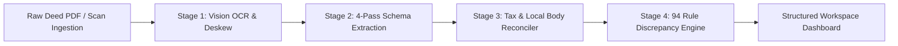

<div align="center">

<h1 align="center">DelhiTSR</h1>

<h3 align="center">Property & Title Assessment Engine for Accelerated Loan Underwriting.</h3>

<p align="center">
  <a href="https://www.python.org/"></a>
  <a href="https://flask.palletsprojects.org/"></a>
  <a href="https://opencv.org/"></a>
  <a href="https://deepmind.google/"></a>
  <a href="#complete-specification-of-all-94-parameters"></a>
  <a href="#"></a>
  <a href="#recognized-banks--housing-finance-companies"></a>
  <a href="#"></a>
</p>

</div>

DelhiTSR is an automated title verification engine designed for loan underwriting and legal due diligence across property ownership chains in the National Capital Territory (NCT) of Delhi and Haryana *(Haryana support operates in BETA)*. Built to power institutional Title Search Reports (TSR), it ingests property deeds, executes computer vision deskewing and dual-engine OCR, extracts 80 structured parameters across a 4-pass pipeline, and audits title history against 94 deterministic statutory parameters covering stamp duty tariffs, municipal transfer taxes, chain continuity, and Sub-Registrar Office (SRO) regulations.

> **What is a Title Search Report (TSR)?**  
> A Title Search Report (TSR) verifies a property's legal ownership history to confirm clear, marketable, and unencumbered title prior to mortgage loan sanction and disbursal. In secured real estate lending, financial institutions require rigorous title verification to ensure collateral enforceability, identify outstanding bank charges, and detect breaks in title continuity.
> 
> **DelhiTSR** automates this examination through **94 deterministic statutory and title continuity parameters**, replacing manual, multi-hour deed scrutiny with instant, auditable discrepancy detection.
> 
> *Note: DelhiTSR is under active development. Compiled TSR document export will be introduced in future releases.*

---

## Table of Contents

- [Processing Pipeline](#processing-pipeline)
  - [1. Document Pre-Processing \& OCR](#1-document-pre-processing--ocr)
  - [2. 80-Field Schema Extraction](#2-80-field-schema-extraction)
  - [3. Tax \& Local Authority Reconciliation](#3-tax--local-authority-reconciliation)
- [Recognized Banks \& Housing Finance Companies](#recognized-banks--housing-finance-companies)
- [5-Tier Legal Severity Scale](#5-tier-legal-severity-scale)
- [Underwriting \& Compliance Policy](#underwriting--compliance-policy)
- [Security \& Data Protection Controls](#security--data-protection-controls)
- **[Complete Specification of All 94 Parameters](#complete-specification-of-all-94-parameters)**
  - [1. Tier 1: Material Defects](#1-tier-1-material-defects)
  - [2. Tier 2: Substantive Defects](#2-tier-2-substantive-defects)
  - [3. Tier 3: Statutory Requisitions](#3-tier-3-statutory-requisitions)
  - [4. Tier 4: Procedural Anomalies](#4-tier-4-procedural-anomalies)
  - [5. Tier 5: Record Notations](#5-tier-5-record-notations)
- [Parameter Enforcement Note](#parameter-enforcement-note)
- [Installation \& Local Setup](#installation--local-setup)
- [Repository Structure](#repository-structure)

---

## Processing Pipeline

Property title chains in India consist of multi-page scanned documents spanning 30+ years of ownership history. DelhiTSR decouples image pre-processing, schema extraction, tax reconciliation, and rule evaluation into clear processing stages:



---

### 1. Document Pre-Processing & OCR

Older title documents in Indian registries (spanning the 1950s through 2010s) often suffer from faded typewriter ink, heavy background stamp paper seals, crooked scans, or low portal resolutions. Before text is parsed, pages pass through an image preparation and extraction pipeline:

1. **High-Resolution Rasterization (`pypdfium2` 3.0x / 300 DPI)**: Renders scanned pages at 3.0x scale with anti-aliasing, ensuring small footnotes, document numbers, and margin seals retain sharp boundaries.
2. **Minimum-Area Deskewing & Affine Alignment (`cv2.minAreaRect` + `cv2.warpAffine`)**: OpenCV detects baseline text tilt by computing minimum area bounding boxes over foreground contours. Any tilt between 0.5° and 45.0° is leveled back to 0° using 2D affine transformation matrices.
3. **Contrast Limited Adaptive Histogram Equalization (CLAHE)**: Faded carbon copies and light typewriter print are enhanced using CLAHE (`cv2.createCLAHE`, `clipLimit=2.5`, `tileGridSize=(8,8)`). This amplifies faint character strokes across localized image tiles without darkening clean white paper margins.
4. **HSV Color-Space Watermark Suppression**: Non-judicial stamp papers and e-stamps frequently place colored seals (red, blue, or purple) across recitals. Pages are mapped into HSV color space to isolate and lighten background stamp ink masks, making text printed underneath readable.
5. **Otsu Binarization & Adaptive Thresholding (`cv2.THRESH_OTSU`)**: Applies Otsu binarization to calculate optimal global threshold limits across contrast-enhanced channels, separating foreground text glyphs from background paper texture and shadow gradients.
6. **3-Tier Hybrid Extraction Fallback (Vector Stream $\rightarrow$ RapidOCR $\rightarrow$ Multimodal Vision)**:
   * **Direct Vector Stream**: Clean, digitally generated PDFs have their text layer extracted directly via `pdfplumber`.
   * **Pre-Processed RapidOCR**: When native text is missing or sparse (<40 characters per page), pages route through `rapidocr-onnxruntime` on the deskewed and contrast-adjusted image.
   * **Direct Multimodal Vision**: When physical degradation is severe (yielding <60 characters through standard OCR due to torn paper, heavy blur, or handwritten attestations), page images route directly to Gemini 2.5 Vision to transcribe recitals, party names, and Sub-Registrar endorsement stamps straight from pixel layout.
7. **Sidecar Text Layer Caching (`.pdf.txt`)**: Extracted page text is automatically saved to local `.pdf.txt` files, so repeated audits or project re-openings load instantly without redundant computation.

---

### 2. 80-Field Schema Extraction

To prevent context drift across long legal deeds, extraction is partitioned into 4 specialized schema passes, extracting 80 target parameters per document:

* **Pass 1: Document Identity & Stamp Paper Ledger**
  * Registration number, volume/page numbers, SRO office, e-stamp certificate number, issue date, article number, execution date, registration date.
* **Pass 2: Party Identity, Gender & KYC Ledger**
  * Transferor and transferee names, PAN identifiers, masked Aadhaar numbers, gender classification (sole female, joint, male), PIN codes, party residential addresses.
* **Pass 3: Financial Consideration & Payment Instrument Ledger**
  * Stated consideration, rental fee/premium, secured loan principal, e-stamp value, MCD tax amount, local authority tax, cheque/DD/RTGS numbers, TDS Form 26QB verification.
* **Pass 4: Property Schedule & Boundary Chain**
  * Property address, plot/flat number, survey/khasra/hadbast number, floor level, share percentage, area measurement and units (Sq. Yards, Bigha, Biswas, Sq. Meters), north/south/east/west boundaries.

---

### 3. Tax & Local Authority Reconciliation

#### Delhi Stamp Duty & Municipal Tax Schedule

Evaluates compliance under the Indian Stamp Act, 1899 (Schedule I-A Delhi Amendment) and Section 147 of the Delhi Municipal Corporation Act, 1957:

| Period / Document Category | Sole Female Purchaser | Joint (Female + Male) | Male Purchaser | Statutory Reference |
| :--- | :--- | :--- | :--- | :--- |
| **Pre-2003 Resale Conveyances** | 8.00% | 8.00% | 8.00% | Article 23 (5% SD + 3% MCD Tax) |
| **Pre-2003 DDA / Government Conveyances** | **6.00%** | **6.00%** | **6.00%** | Pre-2003 DDA Rule |
| **2003 – 2007 Conveyance Deeds** | 5.00% | 7.00% | 8.00% | Delhi Notification 2003 Tariff |
| **2008 – Present Conveyance Deeds** | **4.00%** *(3% SD + 1% MCD)* | **5.00%** *(3.5% SD + 1.5% MCD)* | **6.00%** *(3% SD + 3% MCD)* | Current NCT Delhi Duty Schedule |
| **Blood Relative Gift Deed** | 3.00% | 3.00% | 3.00% | Family Concession Schedule (+ 1% Reg Fee) |
| **Simple Mortgage without Possession** | 2.00% | 2.00% | 2.00% | Article 40 (2% on Principal Amount) |
| **Equitable Mortgage (Title Deposit)** | 0.50% | 0.50% | 0.50% | Article 40(b) Capped Schedule |

#### Haryana Jurisdiction & Duty Rates [BETA]

> **[BETA STAGE MODULE]**: *All Haryana stamp duty, registration fee slab, and urban vs. rural Gram Panchayat jurisdiction rules operate under BETA status.*

Evaluates compliance under the Haryana Stamp Act and Haryana Municipal Corporation Act:

| Transferee Composition | Urban Municipal Area *(MCG / MCF / Sector / HUDA)* | Rural Gram Panchayat Area *(Hadbast / Revenue Estate)* |
| :--- | :--- | :--- |
| **Sole Female Purchaser(s)** | **5.00%** *(3% Stamp Duty + 2% Municipal Duty)* | **3.00%** *(3% Stamp Duty + 0% Municipal Duty)* |
| **Joint Purchasers (Male + Female)** | **6.00%** *(4% Stamp Duty + 2% Municipal Duty)* | **4.00%** *(4% Stamp Duty + 0% Municipal Duty)* |
| **Male Purchaser(s)** | **7.00%** *(5% Stamp Duty + 2% Municipal Duty)* | **5.00%** *(5% Stamp Duty + 0% Municipal Duty)* |

---

## Recognized Banks & Housing Finance Companies

The engine incorporates a normalized lender entity ledger that resolves spelling variations, branch suffixes, and historical bank mergers when auditing mortgage charges and release deeds:

| Institution Category | Recognized Entities & Banking Institutions |
| :--- | :--- |
| **Public Sector Banks** | State Bank of India (SBI), Punjab National Bank (PNB), Bank of Baroda (BOB), Union Bank of India, Canara Bank, Indian Bank, Bank of India (BOI), Central Bank of India, Indian Overseas Bank, UCO Bank, Punjab & Sind Bank. |
| **Private Sector Banks** | HDFC Bank, ICICI Bank, Axis Bank, Kotak Mahindra Bank, IndusInd Bank, YES Bank, IDBI Bank, Federal Bank, Jammu & Kashmir Bank, RBL Bank. |
| **Housing Finance Companies (HFCs) & NBFCs** | LIC Housing Finance Ltd (LICHFL), PNB Housing Finance, Tata Capital Housing Finance, Bajaj Housing Finance, Aditya Birla Housing Finance, Indiabulls Housing Finance, Home First Finance Company, Aavas Financiers, DMI Housing Finance. |
| **Historical Merger Transitions** | • *Corporation Bank / Andhra Bank* $\rightarrow$ **Union Bank of India**<br>• *Syndicate Bank* $\rightarrow$ **Canara Bank**<br>• *Allahabad Bank* $\rightarrow$ **Indian Bank**<br>• *Oriental Bank of Commerce / United Bank of India* $\rightarrow$ **Punjab National Bank**<br>• *Vijaya Bank / Dena Bank* $\rightarrow$ **Bank of Baroda** |

---

## 5-Tier Legal Severity Scale

> **Platform Findings Integration**: All defects, requisitions, procedural anomalies, and record notations identified by the engine are surfaced directly as interactive **findings** within the platform's workspace dashboard, complete with document location markers and contextual risk details.


Findings are classified into a 5-tier severity scale based on legal weight and underwriting impact:

- **Material Defect**: Critical title flaws directly impairing security creation (missing private link deeds, unreleased prior mortgages, invalid post-2011 GPA transfers).
- **Substantive Defect**: Major legal, party, or revenue discrepancies requiring pre-disbursal resolution (missing mutation records, unreleased legal heir shares, lender entity mismatches).
- **Statutory Requisition**: Fiscal deficits and under-collateralization risks (statutory stamp duty deficits, circle rate undervaluation).
- **Procedural Anomaly**: Administrative and registry variances requiring operational verification (SRO jurisdiction mismatches, unit or floor numbering discrepancies).
- **Record Notation**: Informational observations and logged statutory classifications (satisfied historical charges, applied rectification deeds).

---

## Underwriting & Compliance Policy

1. **Objective Risk Assessment**: The engine reports deterministic, verifiable findings (such as statutory stamp duty shortfalls, boundary variances, or missing authority link deeds) to support collateral evaluation and credit decisions.
2. **Underwriting Decision Support**: Audit findings are formatted to accelerate title scrutiny, enabling credit and risk teams to isolate material defects and clear marketable titles with a complete, auditable verification trail.

---

## Security & Data Protection Controls

The platform implements security controls to protect sensitive real estate transactions, identity data, and document processing routines:

### 1. Prompt Injection & AI Safety Controls
* **Payload Encapsulation**: Document text supplied to LLM extraction routines (`main.py`) is bounded inside `<untrusted_document_payload>` XML tags.
* **Defensive System Mandates**: Prompts enforce system-level instructions requiring the engine to process tag contents strictly as static data.
* **Stateless API Executions**: Extraction passes execute statelessly without context memory or database access.
* **Strict Schema Sanitization**: Responses are validated against explicit JSON schemas.

### 2. Authentication & Data Privacy
* **AES-256 PII Encryption**: Aadhaar identifiers are encrypted at rest using Fernet symmetric encryption (`cryptography.fernet`). Decryption occurs strictly in-memory during real-time audit evaluation.
* **Access Control**: Project workspace endpoints enforce ownership validation (`check_project_owner`), restricting access to the authenticated user ID.

### 3. Web Security Headers
* **HTTP Security Headers**: Every HTTP response sets `Content-Security-Policy`, `Strict-Transport-Security`, `Permissions-Policy`, `Cross-Origin-Opener-Policy`, `X-Frame-Options`, `X-Content-Type-Options`, and `Cache-Control`.

---

## Complete Specification of All 94 Parameters

The engine evaluates 94 parameters across 12 domains, checking reconciled metadata for an event against governing laws, title continuity requirements, and state stamp schedules to assign each finding a 5-tier severity rating. All identified defects surface directly as findings within the platform's workspace dashboard.

> **Code String Alignment Note**: The rule type identifiers listed below reflect the exact, runtime constant strings used by the audit engine in `app.py` and supporting verification modules.

### 1. Tier 1: Material Defects

Material defects represent critical title or legal failures that compromise ownership validity or transferability:

| Code | Severity | Finding Name | Statutory Provision / Authority | Verification Function & Technical Scope |
| :--- | :--- | :--- | :--- | :--- |
| `CHAIN_BREAK` | **Material Defect** | Ownership Chain Break | `Sec 5, Transfer of Property Act 1882` | Audits title continuity to ensure the seller in each deed matches the buyer in the preceding registered deed. |
| `UNRESOLVED_MORTGAGE` | **Material Defect** | Outstanding Bank Charge | `Sec 58, Transfer of Property Act 1882` | Identifies outstanding mortgages in title history lacking a registered Release Deed or Reconveyance Deed. |
| `VOID_DEED_WRONG_SRO` | **Material Defect** | SRO Jurisdiction Mismatch | `Sec 28, Registration Act 1908` | Evaluates whether the deed was registered at the Sub-Registrar Office (SRO) holding territorial jurisdiction over the property locality. |
| `GPA_POST_2011_INVALID` | **Material Defect** | Post-2011 GPA Title Transfer | `Suraj Lamp Ruling (Supreme Court, 2011)` | Flags title transfers executed via General Power of Attorney after October 11, 2011 without a registered Sale Deed. |
| `MISSING_GPA_AUTHORIZATION` | **Material Defect** | Missing Attorney Authorization | `Sec 32 & 33, Registration Act 1908` | Verifies that attorney transfers cite a valid registered Power of Attorney in the title chain. |
| `MISSING_SALE_CONSIDERATION` | **Material Defect** | Missing Sale Price | `Sec 54, Transfer of Property Act 1882` | Verifies that monetary sale consideration is declared in conveyances. |
| `MISSING_RENTAL_CONSIDERATION` | **Material Defect** | Missing Lease License Fee | `Sec 105, Transfer of Property Act 1882` | Verifies that rent, premium, or license fees are recited in Lease Deeds. |
| `MISSING_MORTGAGE_VALUE` | **Material Defect** | Missing Secured Loan Principal | `Sec 58, Transfer of Property Act 1882` | Verifies that the principal loan amount is declared in Mortgage Deeds. |
| `GIFT_DEED_WITH_CONSIDERATION` | **Material Defect** | Gift with Consideration | `Sec 122, Transfer of Property Act 1882` | Flags Gift Deeds that recite monetary consideration. |
| `ZERO_CONSIDERATION` | **Material Defect** | Invalid Consideration Value | `Sec 25, Indian Contract Act 1872` | Flags conveyances declaring zero or invalid consideration values. |
| `CONSIDERATION_ANOMALY` | **Material Defect** | High Consideration Variance | `Sec 25, Indian Contract Act 1872` | Flags suspicious consideration values inconsistent with market valuation. |
| `PAN_TRANSFEROR_TRANSFEREE_CLASH` | **Material Defect** | Transferor / Transferee PAN Clash | `Sec 139A, Income Tax Act 1961` | Flags identical PAN numbers listed for both seller and buyer in a transaction. |
| `RELEASE_ORPHAN` | **Material Defect** | Missing Release Deed | `Sec 60, Transfer of Property Act 1882` | Flags satisfied bank loans lacking a formal registered Release Deed. |
| `DATE_ORDER_DEVIATION` | **Material Defect** | Reverse Date Sequencing | `N/A (Engine Chronology Audit)` | Flags derivative deeds dated earlier than their parent root deed. |
| `RECITAL_LINK_DEED_MISSING` | **Material Defect** | Link Deed Recital Missing | `Sec 55, Transfer of Property Act 1882` | Flags conveyances failing to recite underlying root link deed registration numbers. |

### 2. Tier 2: Substantive Defects

Substantive defects represent major legal, registration, or document discrepancies requiring corrective action:

| Code | Severity | Finding Name | Statutory Provision / Authority | Verification Function & Technical Scope |
| :--- | :--- | :--- | :--- | :--- |
| `UNREGULARIZED_GPA_CHAIN` | **Substantive Defect** | Unregularized GPA Chain | `Sec 54, Transfer of Property Act 1882` | Detects title chains ending with an unregularized Power of Attorney or Agreement to Sell without a registered Sale Deed. |
| `MUTATION_RECORD_MISSING` | **Substantive Defect** | Missing Revenue Mutation Record | `Delhi Land Revenue Act 1954 / DMC Act 1957` | Flags property transfers lacking government revenue mutation records. |
| `INVALID_PAN_FORMAT` | **Substantive Defect** | Structural PAN Defect | `Income Tax Rules 1962 (Rule 114)` | Validates Permanent Account Number (PAN) strings against standard Income Tax format. |
| `AMOUNT_WORDS_FIGURES_MISMATCH` | **Substantive Defect** | Amount Words vs Figures Clash | `Sec 91 & 92, Indian Evidence Act 1872` | Detects mismatches between numerical amount figures and written word recitals. |
| `RELEASE_PARTY_MISMATCH` | **Substantive Defect** | Mortgagee Identity Mismatch | `Sec 130, Transfer of Property Act 1882` | Flags release deeds executed by entities other than the original mortgagee bank without debt assignment proof. |
| `LENDER_MISMATCH` | **Substantive Defect** | Lender Name Mismatch | `Banking Regulation Act 1949` | Flags discrepancies between executing lender entity and original charge holder. |
| `AREA_MISMATCH` | **Substantive Defect** | Major Area Calculation Deviation | `Sec 21, Registration Act 1908` | Detects major area variances (>5%) between root deeds and subsequent transfers. |
| `AREA_MISMATCH_MILD` | **Substantive Defect** | Mild Area Calculation Variance | `Sec 21, Registration Act 1908` | Detects minor area variances (<5%) between historical deeds. |
| `METADATA_SRO_MISMATCH` | **Substantive Defect** | Workspace vs Deed SRO Mismatch | `Sec 28, Registration Act 1908` | Cross-checks workspace project SRO metadata against extracted deed SRO. |
| `RECITAL_LEGAL_HEIR_GAP` | **Substantive Defect** | Unresolved Legal Heir Share | `Hindu Succession Act 1956 / Indian Succession Act 1925` | Identifies missing relinquishment deeds from recorded legal co-heirs. |
| `RECITAL_MORTGAGE_CONTRADICTION` | **Substantive Defect** | Recital Mortgage Contradiction | `Sec 55(1)(g), Transfer of Property Act 1882` | Flags deeds declaring property unencumbered despite active bank charge recitals. |
| `RELEASE_OVERFLOW` | **Substantive Defect** | Release Amount Overflow | `Sec 60, Transfer of Property Act 1882` | Flags release deeds where released amount exceeds original loan principal. |
| `RELEASE_AMOUNT_MISMATCH` | **Substantive Defect** | Release Amount Discrepancy | `Sec 60, Transfer of Property Act 1882` | Identifies discrepancies between original mortgage principal and release amount. |

### 3. Tier 3: Statutory Requisitions

Statutory requisitions represent duty shortfalls, tax deficits, and fee reconciliation requirements:

| Code | Severity | Finding Name | Statutory Provision / Authority | Verification Function & Technical Scope |
| :--- | :--- | :--- | :--- | :--- |
| `INSUFFICIENT_STAMP_DUTY` | **Statutory Requisition** | Statutory Stamp Duty Deficit | `Indian Stamp Act 1899 / Delhi Govt Notification 2008` | Reconciles stamp duty paid against statutory gender-adjusted rates (Female 4%, Joint 5%, Male 6%). |
| `UNDER_CIRCLE_RATE_VALUATION` | **Statutory Requisition** | Under Circle Rate Valuation | `Delhi Stamp (Prevention of Undervaluation) Rules 2007` | Calculates minimum valuation based on Delhi Category A-H circle rates and flags undervaluation under Sec 47A. |
| `INSUFFICIENT_REGISTRATION_FEE` | **Statutory Requisition** | Registration Fee Audit | `Table of Registration Fees (Sec 78, Reg Act 1908)` | Reconciles 1% registration fees paid at Sub-Registrar Office. |
| `ESTAMP_VALUE_MISMATCH` | **Statutory Requisition** | e-Stamp Certificate Value Mismatch | `Sec 3, Indian Stamp Act 1899 / SHCIL System` | Flags discrepancies between e-Stamp certificate face value and deed recited stamp paper amount. |
| `ESTAMP_RECITAL_AMOUNT_MISMATCH` | **Statutory Requisition** | e-Stamp Certificate Recital Mismatch | `Sec 3, Indian Stamp Act 1899` | Compares e-Stamp certificate denomination against deed header recitals. |
| `ESTAMP_RECITAL_CERT_MISMATCH` | **Statutory Requisition** | e-Stamp Certificate Number Mismatch | `Sec 3, Indian Stamp Act 1899` | Cross-checks e-Stamp certificate serial numbers against deed endorsements. |
| `INVALID_ESTAMP_CERT_NUMBER` | **Statutory Requisition** | Invalid e-Stamp Certificate Format | `SHCIL e-Stamping Regulations` | Validates e-Stamp certificate serial string formatting. |
| `STAMP_CERTIFICATE_UNVERIFIED` | **Statutory Requisition** | Stamp Certificate Unverified | `Sec 33, Indian Stamp Act 1899` | Flags documents missing e-Stamp / physical stamp certificate numbers. |
| `PARTIALLY_RELEASED` | **Statutory Requisition** | Partial Reconveyance Charge | `Sec 60, Transfer of Property Act 1882` | Identifies partial mortgage releases where encumbrance remains active on remaining property. |

### 4. Tier 4: Procedural Anomalies

Procedural anomalies represent metadata mismatches, property classification variations, and procedural gaps:

| Code | Severity | Finding Name | Statutory Provision / Authority | Verification Function & Technical Scope |
| :--- | :--- | :--- | :--- | :--- |
| `METADATA_FLAT_MISMATCH` | **Procedural Anomaly** | Flat / Unit Number Mismatch | `Sec 21, Registration Act 1908` | Flags flat/unit number variations between workspace project metadata and deed schedule. |
| `METADATA_FLOOR_MISMATCH` | **Procedural Anomaly** | Floor Level Mismatch | `Sec 21, Registration Act 1908` | Flags floor level discrepancies between project metadata and extracted deed schedule. |
| `METADATA_ADDRESS_MISMATCH` | **Procedural Anomaly** | Property Address Mismatch | `Sec 21, Registration Act 1908` | Cross-references extracted property address lines with project metadata. |
| `METADATA_LOCALITY_MISMATCH` | **Procedural Anomaly** | Locality Name Mismatch | `Delhi Stamp Rules 2007` | Cross-checks property locality names against project metadata. |
| `METADATA_LAND_USE_MISMATCH` | **Procedural Anomaly** | Land Use Classification Mismatch | `Delhi Master Plan 2021 (MPD-2021)` | Flags land use mismatches (Residential vs Commercial) between metadata and deed schedule. |
| `METADATA_AUTHORITY_MISMATCH` | **Procedural Anomaly** | Development Authority Mismatch | `DDA Act 1957 / DMC Act 1957` | Flags authority mismatches (DDA vs MCD vs Private Society) between metadata and deed. |
| `METADATA_UPIC_MISMATCH` | **Procedural Anomaly** | Property Tax UPIC Mismatch | `Sec 114, DMC Act 1957` | Flags Unique Property Identification Code (UPIC) variations. |
| `PROPERTY_TYPE_MISMATCH` | **Procedural Anomaly** | Property Type Classification Conflict | `Delhi Master Plan 2021` | Flags property category mismatches (DDA Flat vs Land Plot vs Private Builder Flat). |
| `SOCIETY_MISMATCH` | **Procedural Anomaly** | CGHS / Building Society Mismatch | `Delhi Co-operative Societies Act 2003` | Cross-references building/society names across title chain documents. |
| `ID_MISMATCH` | **Procedural Anomaly** | Property Unit ID Mismatch | `Sec 21, Registration Act 1908` | Reconciles plot, flat, and survey identifiers across link deeds. |
| `RELEASE_AMBIGUOUS` | **Procedural Anomaly** | Ambiguous Release Deed Recital | `Sec 60, Transfer of Property Act 1882` | Flags release deeds with ambiguous loan or property reference recitals. |
| `ESTAMP_DATE_ANOMALY` | **Procedural Anomaly** | e-Stamp Purchase Date Anomaly | `Sec 29, Indian Stamp Act 1899` | Flags e-Stamp certificate purchase dates issued after deed execution date. |

### 5. Tier 5: Record Notations

Record notations represent system logs, statutory jurisdiction notes, and informational observations:

| Code | Severity | Finding Name | Statutory Provision / Authority | Verification Function & Technical Scope |
| :--- | :--- | :--- | :--- | :--- |
| `RECTIFICATION_APPLIED` | **Record Notation** | Rectification Deed Applied | `Sec 26, Specific Relief Act 1963` | Tracks registered Rectification Deeds modifying errors in prior registered link deeds. |
| `MORTGAGE_RESOLVED` | **Record Notation** | Bank Charge Satisfied & Released | `Sec 60, Transfer of Property Act 1882` | Log entry confirming an underlying mortgage charge has been fully satisfied and released. |
| `HARYANA_JURISDICTION_CLASSIFIED` | **Record Notation** | Haryana Jurisdiction Audit [BETA] | `Haryana Stamp Act / Municipal Act` | Log entry classifying property into Haryana Urban Municipal vs Rural Gram Panchayat area. |
| `MISSING_CRITICAL_FIELDS` | **Record Notation** | Missing Extracted Fields | `N/A (Engine Pipeline Log)` | Log entry identifying unextracted optional schema fields in document parsing. |

---

### External & Future Registry Connectors

The following parameter specifications represent external public registry integrations and spatial mapping modules designed for live API connectors:

| Code | Domain Category | Integration Scope & Authority | Status |
| :--- | :--- | :--- | :--- |
| `LIS_PENDENS_CHARGE_CHECK` | Litigation & Charges | High Court & District Court CCTNS e-Courts Lis Pendens search (`Sec 52 TPA 1882`) | External API Connector |
| `ATTACHMENT_ORDER_CHECK` | Revenue Liens | Revenue Recovery & Judicial Attachment Order Registry (`Order 38 Rule 5 CPC`) | External API Connector |
| `SARFAESI_NOTICE_CHECK` | Bank Enforcement | CERSAI & Commercial Bank SARFAESI Demand Notice Registry (`Sec 13(2) SARFAESI Act`) | External API Connector |
| `CORPORATE_CIN_CHECK` | Corporate Authority | MCA21 Corporate Identification Number (CIN) Registry (`Sec 12 Companies Act 2013`) | External API Connector |
| `BOUNDARY_NORTH_MISMATCH` | Spatial Parcel Audit | GIS Plot Map & Revenue Shajra Map boundary overlay matching | Spatial GIS Module |
| `BOUNDARY_SOUTH_MISMATCH` | Spatial Parcel Audit | GIS Plot Map & Revenue Shajra Map boundary overlay matching | Spatial GIS Module |
| `BOUNDARY_EAST_MISMATCH` | Spatial Parcel Audit | GIS Plot Map & Revenue Shajra Map boundary overlay matching | Spatial GIS Module |
| `BOUNDARY_WEST_MISMATCH` | Spatial Parcel Audit | GIS Plot Map & Revenue Shajra Map boundary overlay matching | Spatial GIS Module |

---

## Parameter Enforcement Note

Title parameters cannot be evaluated through isolated heuristics. Due diligence requires evaluating interdependent statutory conditions across the entire title bundle:

### Isolated Heuristics vs. Interdependent Enforcement

| Parameter | Isolated Heuristic Check | DelhiTSR Interdependent Enforcement |
| :--- | :--- | :--- |
| **Prior Link Deeds** | Flags any cited document number not found in the upload list. | Checks document origin first. Exempts government allotments (DDA, L&DO, Gazette notifications) from missing root deed defects while enforcing link deed continuity for private transfers. |
| **e-Stamp Authorization** | Checks if an e-stamp certificate exists on page 1. | Scans all pages, validates state certificate number formatting, and cross-checks the e-stamp buyer against deed transferors and power of attorney records. |
| **Encumbrance Recitals** | Reads text phrases like "free from encumbrances". | Cross-references body text declarations against active mortgage entries, court attachment notices, and bank charge records in the session bundle. |
| **Legal Heir Succession** | Checks if the word "heir" or "intestate" is present. | When a deceased owner's property is sold by one family member, the engine checks whether all other legal heirs have signed registered Relinquishment Deeds giving up their ownership shares. |

---

### Core Enforcement Mechanisms

1. **Document Provenance and Root Context**  
   Before checking title continuity, the engine evaluates whether the starting deed is a government allotment (DDA, L&DO, President of India grant). If so, it exempts the initial transfer from missing root deed defects. For private transfers, it enforces complete link deed chain continuity.

2. **Cross-Page Entity and Role Matching**  
   The engine extracts party identities, aliases, and capacities across all pages. It verifies that e-stamp purchasers match the executing transferors, ensuring third-party stamp purchases without authorization are flagged immediately.

3. **Recital and Encumbrance Reconciliation**  
   Declarations made in deed text are checked against independent document findings. If a deed states the property is unencumbered but mortgage recitals or bank charges exist in related session documents, a contradiction flag is raised.

4. **Legal Heir Relinquishment Verification**  
   When a property owner dies without a Will, all legal heirs inherit equal ownership shares. If only one heir sells the property, the engine verifies whether registered Relinquishment or Release Deeds exist from all other legal heirs to confirm the seller has 100% transferable title.

5. **Weighted Severity Classification**  
   Findings are mapped to a 5-tier scale based on legal weight and underwriting impact:
   - **Material Defect**: Critical title flaws directly impairing security creation (missing private link deeds, unreleased legal heir ownership shares).
   - **Substantive Defect**: Major flaws requiring pre-disbursal resolution (e-stamp party mismatches, invalid certificate formats).
   - **Statutory Requisition**: Financial deficits (stamp duty shortfalls).
   - **Procedural Anomaly**: Operational gaps (missing witness details, unverified SRO seals).
   - **Record Notation**: System logs and informational observations.

---

## Installation & Local Setup

### Prerequisites

* Python 3.10+
* OpenCV & Poppler dependencies
* Tesseract OCR / ONNX Runtime (for RapidOCR)

### Step 1: Clone Repository & Create Virtual Environment

```bash
git clone https://github.com/your-org/tsr-engine.git
cd tsr-engine

# Create virtual environment
python -m venv venv

# Activate virtual environment
# Windows:
.\venv\Scripts\activate
# Linux/macOS:
source venv/bin/activate
```

### Step 2: Install Dependencies

```bash
pip install -r requirements.txt
```

### Step 3: Configure Environment Variables

Create a `.env` file in the root directory:

```env
FLASK_APP=app.py
FLASK_ENV=development
SECRET_KEY=your-secret-key-here
GEMINI_API_KEY=your-google-gemini-api-key
DATABASE_URL=sqlite:///instance/tsr_engine.db
```

### Step 4: Run Development Server

```bash
python app.py
```

---

## Repository Structure

```
tsr-engine/
├── app.py                     # Flask application entrypoint & API routes
├── main.py                    # OpenCV deskewing, RapidOCR engine & 4-Pass LLM extraction
├── circle_rates.py            # Circle rates, stamp duty matrices & Haryana jurisdiction classifier
├── doris_scraper.py           # Delhi DORIS sub-registrar scraper session manager
├── deed_doc_scraper.py        # Sub-Registrar document indexing scraper
├── recital_verification.py    # Recital verification & boundary cross-matcher
├── stamp_verification.py      # E-Stamp certificate validation engine
├── static/                    # CSS, JavaScript UI components & assets
├── templates/
│   └── workspace.html         # Main dashboard & metric card views
├── instance/                  # SQLite database instance
├── uploads/                   # Temporary upload directory
└── requirements.txt           # Python dependencies manifest
```
