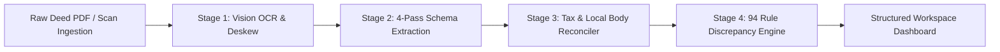

# DelhiTSR
Title Intelligence Engine (Delhi NCT & Haryana [BETA])

<p align="left">
  <a href="https://www.python.org/"></a>
  <a href="https://flask.palletsprojects.org/"></a>
  <a href="https://opencv.org/"></a>
  <a href="https://deepmind.google/"></a>
  <a href="#complete-specification-of-all-94-parameters"></a>
  <a href="#"></a>
  <a href="#"></a>
</p>

DelhiTSR is a title verification engine for property ownership chains across the National Capital Territory (NCT) of Delhi and Haryana *(Haryana support operates in BETA)*. Built for property title search reporting (TSR), it ingests property deeds, executes computer vision page deskewing and dual-engine OCR, extracts 80 structured parameters across a 4-pass pipeline, and audits title history against 94 deterministic rules covering stamp duty tariffs, municipal transfer taxes, boundary continuity, and Sub-Registrar Office (SRO) regulations.

> **Note**: DelhiTSR is under active development. While the engine currently audits title deeds, reconciles stamp duty tariffs, and evaluates 94 verification checks, compiled Title Search Report (TSR) generation will be introduced in future releases.

---

## Table of Contents

- [Processing Pipeline](#processing-pipeline)
  - [1. Document Pre-Processing \& OCR](#1-document-pre-processing--ocr)
  - [2. 80-Field Schema Extraction](#2-80-field-schema-extraction)
  - [3. Tax \& Local Authority Reconciliation](#3-tax--local-authority-reconciliation)
- [Recognized Banks \& Housing Finance Companies](#recognized-banks--housing-finance-companies)
- [5-Tier Legal Severity Scale](#5-tier-legal-severity-scale)
- [Legal Privilege \& Compliance Policy](#legal-privilege--compliance-policy)
- [Security \& Data Protection Controls](#security--data-protection-controls)
- [Complete Specification of All 94 Parameters](#complete-specification-of-all-94-parameters)
- [Parameter Enforcement Note](#parameter-enforcement-note)
- [Installation \& Local Setup](#installation--local-setup)
- [Repository Structure](#repository-structure)

---

## Processing Pipeline

Property title chains in India consist of multi-page scanned documents spanning 30+ years of ownership history. DelhiTSR decouples image pre-processing, schema extraction, tax reconciliation, and rule evaluation into clear processing stages:



---

### 1. Document Pre-Processing & OCR

Before document text is parsed, pages undergo automated computer vision processing:

1. **Orientation Angle Detection**: `pypdfium2` renders PDF pages to numpy arrays. OpenCV detects baseline text orientation using minimum area bounding rectangles (`cv2.minAreaRect`).
2. **Affine Rotation**: Rotates pages back to 0° alignment for detected skew angles between 0.5° and 45.0°.
3. **Otsu Binarization**: Cleans background yellowing, shadow artifacts, and faint watermarks using Otsu thresholding (`cv2.THRESH_OTSU`).
4. **Adaptive Text Extraction**:
   * **Direct Vector Stream**: Embedded digital fonts are extracted directly via `pdfplumber`.
   * **RapidOCR Fallback**: If page text density is below 40 characters per page (indicating scanned images), pages automatically route to `rapidocr-onnxruntime` with OpenCV contrast enhancement.
   * **Multimodal Vision Fallback**: Handwritten recitals, faint endorsement stamps, or damaged paper marginalia route to Gemini 2.5 Vision.

---

### 2. 80-Field Schema Extraction

To prevent context drift across long legal deeds, extraction is partitioned into 4 specialized schema passes, extracting 80 target parameters per document:

* **Pass 1: Document Identity & Stamp Paper Ledger**
  * Registration number, volume/page numbers, SRO office, e-stamp certificate number, issue date, article number, execution date, registration date.
* **Pass 2: Party Identity, Gender & KYC Ledger**
  * Transferor and transferee names, PAN identifiers, masked Aadhaar numbers, gender classification (sole female, joint, male), PIN codes, party residential addresses.
* **Pass 3: Financial Consideration & Payment Instrument Ledger**
  * Stated consideration, rental fee/premium, secured loan principal, e-stamp value, MCD tax amount, local authority tax, cheque/DD/RTGS numbers, TDS Form 26QB verification.
* **Pass 4: Property Schedule & Boundary Chain**
  * Property address, plot/flat number, survey/khasra/hadbast number, floor level, share percentage, area measurement and units (Sq. Yards, Bigha, Biswas, Sq. Meters), north/south/east/west boundaries.

---

### 3. Tax & Local Authority Reconciliation

#### Delhi Stamp Duty & Municipal Tax Schedule

Evaluates compliance under the Indian Stamp Act, 1899 (Schedule I-A Delhi Amendment) and Section 147 of the Delhi Municipal Corporation Act, 1957:

| Period / Document Category | Sole Female Purchaser | Joint (Female + Male) | Male Purchaser | Statutory Reference |
| :--- | :--- | :--- | :--- | :--- |
| **Pre-2003 Resale Conveyances** | 8.00% | 8.00% | 8.00% | Article 23 (5% SD + 3% MCD Tax) |
| **Pre-2003 DDA / Government Conveyances** | **6.00%** | **6.00%** | **6.00%** | Pre-2003 DDA Rule |
| **2003 – 2007 Conveyance Deeds** | 5.00% | 7.00% | 8.00% | Delhi Notification 2003 Tariff |
| **2008 – Present Conveyance Deeds** | **4.00%** *(3% SD + 1% MCD)* | **5.00%** *(3.5% SD + 1.5% MCD)* | **6.00%** *(3% SD + 3% MCD)* | Current NCT Delhi Duty Schedule |
| **Blood Relative Gift Deed** | 3.00% | 3.00% | 3.00% | Family Concession Schedule (+ 1% Reg Fee) |
| **Simple Mortgage without Possession** | 2.00% | 2.00% | 2.00% | Article 40 (2% on Principal Amount) |
| **Equitable Mortgage (Title Deposit)** | 0.50% | 0.50% | 0.50% | Article 40(b) Capped Schedule |

#### Haryana Jurisdiction & Duty Rates [BETA]

> **[BETA STAGE MODULE]**: *All Haryana stamp duty, registration fee slab, and urban vs. rural Gram Panchayat jurisdiction rules operate under BETA status.*

Evaluates compliance under the Haryana Stamp Act and Haryana Municipal Corporation Act:

| Transferee Composition | Urban Municipal Area *(MCG / MCF / Sector / HUDA)* | Rural Gram Panchayat Area *(Hadbast / Revenue Estate)* |
| :--- | :--- | :--- |
| **Sole Female Purchaser(s)** | **5.00%** *(3% Stamp Duty + 2% Municipal Duty)* | **3.00%** *(3% Stamp Duty + 0% Municipal Duty)* |
| **Joint Purchasers (Male + Female)** | **6.00%** *(4% Stamp Duty + 2% Municipal Duty)* | **4.00%** *(4% Stamp Duty + 0% Municipal Duty)* |
| **Male Purchaser(s)** | **7.00%** *(5% Stamp Duty + 2% Municipal Duty)* | **5.00%** *(5% Stamp Duty + 0% Municipal Duty)* |

---

## Recognized Banks & Housing Finance Companies

The engine incorporates a normalized lender entity ledger that resolves spelling variations, branch suffixes, and historical bank mergers when auditing mortgage charges and release deeds:

| Institution Category | Recognized Entities & Banking Institutions |
| :--- | :--- |
| **Public Sector Banks** | State Bank of India (SBI), Punjab National Bank (PNB), Bank of Baroda (BOB), Union Bank of India, Canara Bank, Indian Bank, Bank of India (BOI), Central Bank of India, Indian Overseas Bank, UCO Bank, Punjab & Sind Bank. |
| **Private Sector Banks** | HDFC Bank, ICICI Bank, Axis Bank, Kotak Mahindra Bank, IndusInd Bank, YES Bank, IDBI Bank, Federal Bank, Jammu & Kashmir Bank, RBL Bank. |
| **Housing Finance Companies (HFCs) & NBFCs** | LIC Housing Finance Ltd (LICHFL), PNB Housing Finance, Tata Capital Housing Finance, Bajaj Housing Finance, Aditya Birla Housing Finance, Indiabulls Housing Finance, Home First Finance Company, Aavas Financiers, DMI Housing Finance. |
| **Historical Merger Transitions** | • *Corporation Bank / Andhra Bank* $\rightarrow$ **Union Bank of India**<br>• *Syndicate Bank* $\rightarrow$ **Canara Bank**<br>• *Allahabad Bank* $\rightarrow$ **Indian Bank**<br>• *Oriental Bank of Commerce / United Bank of India* $\rightarrow$ **Punjab National Bank**<br>• *Vijaya Bank / Dena Bank* $\rightarrow$ **Bank of Baroda** |

---

## 5-Tier Legal Severity Scale

> **Platform Findings Integration**: All defects, requisitions, procedural anomalies, and record notations identified by the engine are surfaced directly as interactive **findings** within the platform's workspace dashboard, complete with document location markers and contextual risk details.


Findings are classified into a 5-tier legal scale based on legal weight:

- **Material Defect**: Critical flaws (missing private link deeds, unreleased legal heir ownership shares).
- **Substantive Defect**: Major flaws (e-stamp party mismatches, invalid certificate formats).
- **Statutory Requisition**: Financial deficits (stamp duty shortfalls).
- **Procedural Anomaly**: Operational gaps (missing witness details, unverified SRO seals).
- **Record Notation**: System logs and informational observations.

---

## Legal Privilege & Compliance Policy

1. **Factual Output Only**: The engine reports objective observations (such as stamp duty calculations, boundary discrepancies, or missing authorization documents). It does not declare titles void, defective, or invalid.
2. **Advocate Support**: Output is structured to support legal review while preserving advocate-client privilege.

---

## Security & Data Protection Controls

The platform implements security controls to protect sensitive real estate transactions, identity data, and document processing routines:

### 1. Prompt Injection & AI Safety Controls
* **Payload Encapsulation**: Document text supplied to LLM extraction routines (`main.py`) is bounded inside `<untrusted_document_payload>` XML tags.
* **Defensive System Mandates**: Prompts enforce system-level instructions requiring the engine to process tag contents strictly as static data.
* **Stateless API Executions**: Extraction passes execute statelessly without context memory or database access.
* **Strict Schema Sanitization**: Responses are validated against explicit JSON schemas.

### 2. Authentication & Data Privacy
* **AES-256 PII Encryption**: Aadhaar identifiers are encrypted at rest using Fernet symmetric encryption (`cryptography.fernet`). Decryption occurs strictly in-memory during real-time audit evaluation.
* **Access Control**: Project workspace endpoints enforce ownership validation (`check_project_owner`), restricting access to the authenticated user ID.

### 3. Web Security Headers
* **HTTP Security Headers**: Every HTTP response sets `Content-Security-Policy`, `Strict-Transport-Security`, `Permissions-Policy`, `Cross-Origin-Opener-Policy`, `X-Frame-Options`, `X-Content-Type-Options`, and `Cache-Control`.

---

## Complete Specification of All 94 Parameters

The engine evaluates 94 parameters across 12 domains, checking reconciled metadata for an event against governing laws, title continuity requirements, and state stamp schedules to assign each finding a 5-tier severity rating. All identified defects surface directly as findings within the platform's workspace dashboard:

### 1. Legal & Statutory Registration Rules

Audits compliance against registration laws, SRO territorial jurisdiction, and power of attorney execution mandates:

| Code | Severity | Finding Name | Statutory Provision / Authority | Verification Function & Technical Scope |
| :--- | :--- | :--- | :--- | :--- |
| `VOID_DEED_WRONG_SRO` | **Material Defect** | SRO Jurisdiction Mismatch | `Sec 28, Registration Act 1908` | Evaluates whether the deed was registered at the Sub-Registrar Office (SRO) holding territorial jurisdiction over the property locality, flagging registrations outside territorial limits as void. |
| `GPA_POST_2011_INVALID` | **Material Defect** | Post-2011 GPA Title Transfer | `Suraj Lamp Ruling (Supreme Court, 2011)` | Flags property title transfers executed via General Power of Attorney after October 11, 2011 without a registered Sale Deed. |
| `MISSING_GPA_AUTHORIZATION` | **Material Defect** | Missing Attorney Authorization | `Sec 32 & 33, Registration Act 1908` | Verifies that conveyances executed by an attorney-in-fact reference a valid registered General or Special Power of Attorney (GPA/SPA) in the title chain. |
| `UNREGULARIZED_GPA_CHAIN` | **Substantive Defect** | Unregularized GPA Chain | `Sec 54, Transfer of Property Act 1882` | Detects title histories ending with an unregularized General Power of Attorney or Agreement to Sell without a subsequently registered Sale Deed. |
| `PROPERTY_NOT_IN_DELHI` | **Procedural Anomaly** | Out-of-Jurisdiction Location | `Delhi Land Revenue Act 1954` | Flags property localities situated outside the revenue districts of NCT Delhi or Haryana (BETA) boundaries. |
| `SEC28_REG_ACT_AUDIT` | **Record Notation** | Mandatory SRO Validation | `Sec 28, Registration Act 1908` | Audits official Sub-Registrar registration endorsement stamps against official SRO territorial revenue maps. |
| `SRO_TERRITORY_MATRIX` | **Record Notation** | SRO Territory Ledger Mapping | `N/A (Engine Jurisdiction Ledger)` | Cross-references SRO office designations on deeds against the engine's 350+ Delhi revenue locality mapping matrix. |
| `SRO_CODE_NORMALIZER` | **Record Notation** | SRO Code Canonicalization | `N/A (Engine Canonical Logic)` | Normalizes variant SRO text strings (e.g., 'SRO V-A Hauz Khas' to `5a`) into canonical system SRO identifiers. |
| `SRO_LOCALITY_TOKEN_MATCH` | **Record Notation** | Locality Boundary Token Check | `N/A (Engine Token Matching)` | Performs tokenized string matching between the property schedule address and official SRO jurisdiction ledgers. |
| `EXPLICIT_SRO_RECITAL` | **Record Notation** | Explicit Header SRO Recital | `Sec 28, Registration Act 1908` | Validates explicit SRO jurisdiction recitals in deed preambles against official endorsement registry stamps. |

### 2. Transaction Value & Consideration Rules

Audits monetary consideration declarations, lease rentals, mortgage principal amounts, and gift deed validity:

| Code | Severity | Finding Name | Statutory Provision / Authority | Verification Function & Technical Scope |
| :--- | :--- | :--- | :--- | :--- |
| `MISSING_SALE_CONSIDERATION` | **Material Defect** | Missing Sale Price | `Sec 54, Transfer of Property Act 1882` | Validates that monetary transaction consideration is explicitly declared in conveyances as required for legal validity. |
| `MISSING_RENTAL_CONSIDERATION` | **Material Defect** | Missing Lease License Fee | `Sec 105, Transfer of Property Act 1882` | Verifies that rent, premium, or monthly license fees are explicitly recited in Lease Deeds and Leave & License agreements. |
| `MISSING_MORTGAGE_VALUE` | **Material Defect** | Missing Secured Loan Principal | `Sec 58, Transfer of Property Act 1882` | Ensures Mortgage Deeds explicitly declare the principal loan amount secured by the property. |
| `GIFT_DEED_WITH_CONSIDERATION` | **Material Defect** | Gift with Consideration | `Sec 122, Transfer of Property Act 1882` | Flags Gift Deeds that recite financial consideration, violating the legal requirement that gifts must be voluntary transfers without monetary payment. |
| `CONSIDERATION_ZERO_OR_NEGATIVE` | **Material Defect** | Invalid Consideration Value | `Sec 25, Indian Contract Act 1872` | Flags conveyances declaring zero, negative, or invalid numeric values for monetary transaction consideration. |
| `CONSIDERATION_FORMAT_AUDIT` | **Record Notation** | Consideration Parsing Validation | `N/A (Engine Financial Parser)` | Audits numerical figures against written word consideration recitals (e.g., ₹5,00,000 vs 'Fifty Thousand') to detect monetary transcription discrepancies. |
| `CONSIDERATION_CURRENCY_CHECK` | **Record Notation** | Currency Unit Standardization | `Reserve Bank of India Act 1934` | Verifies that monetary consideration values are recorded in standard Indian Rupee (INR / ₹) currency denominations. |

### 3. Ownership History & Title Chain Rules

Audits 30-year ownership continuity, link deed sequencing, execution dates, and revenue mutation records:

| Code | Severity | Finding Name | Statutory Provision / Authority | Verification Function & Technical Scope |
| :--- | :--- | :--- | :--- | :--- |
| `CHAIN_BREAK_TRANSFEROR_MISMATCH` | **Material Defect** | Ownership Chain Break | `Sec 5, Transfer of Property Act 1882` | Audits 30-year title continuity to ensure the seller/transferor in each deed matches the buyer/transferee in the immediately preceding registered conveyance. |
| `CHRONOLOGICAL_DATE_ANOMALY` | **Material Defect** | Reverse Date Sequencing | `N/A (Engine Chronology Audit)` | Identifies reverse date sequencing where a derivative title deed bears an execution date earlier than its parent root deed. |
| `FUTURE_REGISTRATION_DATE` | **Material Defect** | Future Registration Stamp | `N/A (Engine Temporal Audit)` | Flags registration dates that occur in the future relative to system execution or document processing dates. |
| `MUTATION_RECORD_MISSING` | **Substantive Defect** | Missing Revenue Mutation Record | `Delhi Land Revenue Act 1954 / DMC Act 1957` | Flags property transfers lacking corresponding government revenue mutation records (Khasra/Khatauni or MCD property tax mutation). |
| `MULTIPLE_ACTIVE_OWNERS` | **Substantive Defect** | Ambiguous Undivided Ownership | `Sec 44, Transfer of Property Act 1882` | Detects conflicting concurrent full ownership claims over the same property unit across unlinked conveyances. |
| `DEED_EXECUTION_DATE_MISSING` | **Procedural Anomaly** | Missing Execution Date | `Sec 23, Registration Act 1908` | Checks for missing execution or signing dates on deed preambles and signature recitals. |
| `DEED_REGISTRATION_DATE_MISSING` | **Procedural Anomaly** | Missing SRO Registration Date | `Sec 60, Registration Act 1908` | Flags conveyances lacking official Sub-Registrar registration endorsement dates. |
| `TITLE_CHAIN_SPAN_AUDIT` | **Record Notation** | Title History Duration Check | `Sec 90, Indian Evidence Act 1872` | Computes the total span of title documentation in years and flags title chains shorter than the 30-year requirement for proving ancient documents. |
| `PARTIAL_SHARE_TRANSFER_CHECK` | **Record Notation** | Undivided Share Audit | `Sec 44, Transfer of Property Act 1882` | Tracks the exact percentage of undivided land share conveyed in each title deed to ensure full title conveyance. |
| `DOCUMENT_SEQUENCE_NORMALIZER` | **Record Notation** | Chronological Ledger Order | `N/A (Engine Chronology Audit)` | Sorts multi-deed document packages into strict chronological sequence based on registration timestamps. |

### 4. Party Identity & Tax ID Rules

Audits party identities, Income Tax PAN compliance, corporate CIN numbers, and signatory capacity:

| Code | Severity | Finding Name | Statutory Provision / Authority | Verification Function & Technical Scope |
| :--- | :--- | :--- | :--- | :--- |
| `MISSING_TRANSFEROR_NAME` | **Material Defect** | Missing Seller Identity | `Sec 5, Transfer of Property Act 1882` | Checks for missing or unextracted seller/transferor party names in conveyances. |
| `MISSING_TRANSFEREE_NAME` | **Material Defect** | Missing Buyer Identity | `Sec 5, Transfer of Property Act 1882` | Checks for missing or unextracted buyer/transferee party names in conveyances. |
| `INVALID_PAN_FORMAT` | **Substantive Defect** | Structural PAN Defect | `Income Tax Rules 1962 (Rule 114)` | Validates extracted Permanent Account Number (PAN) strings against the official Income Tax format (`[A-Z]{5}[0-9]{4}[A-Z]{1}`). |
| `MISSING_PARTY_PAN` | **Statutory Requisition** | Missing Income Tax PAN | `Sec 139A, Income Tax Act 1961` | Flags high-value property transactions registered without PAN details or Form 60/61 declarations. |
| `CORPORATE_CIN_CHECK` | **Procedural Anomaly** | Corporate Identity Audit | `Sec 12, Companies Act 2013` | Validates Corporate Identification Numbers (CIN/LLPIN) for corporate entities buying or selling real estate. |
| `PARTY_ADDRESS_MISSING` | **Procedural Anomaly** | Missing Party Address | `Sec 32A, Registration Act 1908` | Identifies deed parties lacking formal residential or corporate address recitals. |
| `REPRESENTATIVE_CAPACITY_CHECK` | **Record Notation** | Execution Authority Audit | `Sec 180, Companies Act 2013` | Verifies board resolutions, power of attorney recitals, or trust authorizations for corporate and non-individual signatories. |

### 5. Name Spelling Variation Rules

Audits party name spelling variations across title chain documents, alias recitals, and honorifics:

| Code | Severity | Finding Name | Statutory Provision / Authority | Verification Function & Technical Scope |
| :--- | :--- | :--- | :--- | :--- |
| `NAME_SPELLING_CRITICAL_DEVIATION` | **Material Defect** | Major Name Mismatch | `N/A (Engine Levenshtein Audit)` | Flags severe spelling discrepancies (Levenshtein distance > 0.35) between party names across successive title chain deeds. |
| `NAME_SPELLING_MODERATE_DEVIATION` | **Substantive Defect** | Moderate Name Variation | `N/A (Engine Levenshtein Audit)` | Flags moderate spelling variations (such as phonetic transliteration differences) in party names across chain documents. |
| `ALIAS_NAME_RECITAL_CHECK` | **Statutory Requisition** | Alias / Also Known As Recital | `Sec 91 & 92, Indian Evidence Act 1872` | Verifies whether name variations across deeds are backed by explicit alias recitals ('also known as') or official gazette notifications. |
| `SALUTATION_NORMALIZER` | **Record Notation** | Name Honorific Normalization | `N/A (Engine Name Normalizer)` | Strips honorifics (Shri, Smt, Dr, M/s) prior to performing fuzzy string comparison across party records. |
| `SURNAME_INITIAL_EXPANSION` | **Record Notation** | Initial vs. Full Name Check | `N/A (Engine Name Normalizer)` | Matches abbreviated middle names or initials against full expanded names (e.g., 'R.K. Sharma' vs 'Rajesh Kumar Sharma'). |
| `PARTY_ROLE_CANONICALIZER` | **Record Notation** | Party Role Normalization | `N/A (Engine Entity Canonicalizer)` | Maps vernacular party role terms (Vendor/Vendee, Lessor/Lessee, Donor/Donee) into standard system roles. |

### 6. Mortgage & Charge Release Rules

Audits outstanding bank mortgages, reconveyance deeds, NOC certificates, court attachments, and lis pendens notices:

| Code | Severity | Finding Name | Statutory Provision / Authority | Verification Function & Technical Scope |
| :--- | :--- | :--- | :--- | :--- |
| `UNRELEASED_MORTGAGE_CHARGE` | **Material Defect** | Outstanding Bank Charge | `Sec 58, Transfer of Property Act 1882` | Identifies outstanding equitable or registered mortgages in the title history lacking a registered Deed of Reconveyance or Bank Release Deed. |
| `MISSING_RECONVEYANCE_DEED` | **Material Defect** | Missing Release Deed | `Sec 60, Transfer of Property Act 1882` | Flags satisfied bank loans where debt payoff is recited but no formal registered Reconveyance Deed is on record. |
| `MORTGAGE_AMOUNT_EXCEEDED` | **Substantive Defect** | Charge Amount Discrepancy | `Sec 60, Transfer of Property Act 1882` | Detects discrepancies where release deed amounts do not cover the principal secured loan amount specified in the original Mortgage Deed. |
| `NOC_BANK_RELEASE_MISSING` | **Substantive Defect** | Missing Bank No Objection Certificate | `Sec 48, Transfer of Property Act 1882` | Flags transactions on mortgaged property conducted without written No Objection Certificates (NOC) from the mortgagee institution. |
| `ENCLOSED_DEPOSIT_TITLE_DEEDS` | **Statutory Requisition** | Equitable Mortgage Audit | `Sec 17(1)(c), Registration Act 1908` | Audits Memorandum of Deposit of Title Deeds (MODTD) for compulsory registration under registration law. |
| `MORTGAGE_DATE_PRIORITY` | **Substantive Defect** | Mortgage Priority Audit | `Sec 48, Transfer of Property Act 1882` | Verifies chronological priority of multiple mortgages registered against the same property. |
| `RELEASE_DEED_PARTY_MISMATCH` | **Substantive Defect** | Mortgagee Identity Mismatch | `Sec 130, Transfer of Property Act 1882` | Flags release deeds executed by entities other than the original mortgagee bank without proof of debt assignment. |
| `PARTIAL_RELEASE_CHARGE` | **Statutory Requisition** | Partial Reconveyance Audit | `Sec 60, Transfer of Property Act 1882` | Identifies partial discharge of mortgage debt where an encumbrance remains active over undivided property portions. |
| `LIS_PENDENS_CHARGE_CHECK` | **Material Defect** | Pending Court Litigation Charge | `Sec 52, Transfer of Property Act 1882` | Flags pending court litigation recitals or stay orders registered against the property. |
| `ATTACHMENT_ORDER_CHECK` | **Material Defect** | Judicial / Revenue Attachment | `Order 38 Rule 5, CPC 1908 / Revenue Recovery Act` | Flags revenue recovery attachment orders, tax department liens, or court attachment decrees against the property. |
| `LENDER_MERGER_TRANSITION` | **Record Notation** | Bank Merger Mapping | `Banking Regulation Act 1949 (Sec 44A)` | Maps historical bank mergers (e.g., Corporation Bank to Union Bank of India) when verifying release deeds executed by successor banks. |
| `MORTGAGE_PROPERTY_SCHEDULE_MATCH` | **Procedural Anomaly** | Mortgage Property Match | `Sec 21, Registration Act 1908` | Cross-checks property unit details in Mortgage Deeds against the underlying title deed schedule. |
| `RECHARGE_STAMP_DUTY_CHECK` | **Statutory Requisition** | Mortgage Stamp Duty Audit | `Article 40, Indian Stamp Act 1899` | Verifies stamp duty paid on Mortgage Deeds with or without possession. |
| `MODTD_REGISTRATION_CHECK` | **Statutory Requisition** | MODTD Registration Audit | `Sec 17(1), Registration Act 1908 / State Stamp Acts` | Verifies compulsory registration of Memorandum of Deposit of Title Deeds under state stamp laws. |
| `ENCUMBRANCE_FREE_DECLARATION` | **Record Notation** | Encumbrance Warranty Recital | `Sec 55(1)(g), Transfer of Property Act 1882` | Audits seller warranty recitals declaring the property free from all encumbrances, liens, and litigation. |
| `CHARGE_REGISTER_CANONICALIZER` | **Record Notation** | Encumbrance Ledger Normalization | `N/A (Engine Charge Normalizer)` | Compiles all active, partial, and discharged charges into a unified property encumbrance ledger. |

### 7. Lender Registry & Bank Merger Rules

Audits recognized lending institutions, historical bank mergers, and SARFAESI enforcement charges:

| Code | Severity | Finding Name | Statutory Provision / Authority | Verification Function & Technical Scope |
| :--- | :--- | :--- | :--- | :--- |
| `UNRECOGNIZED_LENDING_INSTITUTION` | **Procedural Anomaly** | Unknown Lender Entity | `RBI / NHB Regulatory Guidelines` | Flags mortgage instruments executed with private entities outside the engine's 100+ recognized Commercial Bank, HFC, and NBFC registry. |
| `HISTORICAL_BANK_MERGER_MAP` | **Record Notation** | Merger Succession Mapping | `Banking Regulation Act 1949 (Sec 44A)` | Automatically resolves institutional succession for merged banks (e.g., Syndicate Bank to Canara Bank, e-Vijaya Bank to Bank of Baroda). |
| `NBFC_HFC_REGISTRATION_CHECK` | **Statutory Requisition** | RBI / NHB License Audit | `Reserve Bank of India Act 1934 (Sec 45-IA)` | Audits lender entities against the engine's 100+ RBI/NHB registered HFC & NBFC ledger to verify regulatory licensing and mortgage creation authority. |
| `MORTGAGEE_NAME_STANDARDIZATION` | **Record Notation** | Lender Name Normalization | `N/A (Engine Levenshtein Normalizer)` | Standardizes corporate variations in bank names (e.g., 'State Bank of India', 'SBI', 'S.B.I.') into canonical entity codes using 85% Levenshtein fuzzy matching. |
| `ASSIGNMENT_OF_DEBT_CHECK` | **Substantive Defect** | Debt Assignment Verification | `Sec 130, Transfer of Property Act 1882` | Verifies that when a successor bank or ARC releases a mortgage originally created by a different lender, a registered Deed of Assignment of Debt exists in the title chain to validate legal transfer of mortgage rights. |
| `SARFAESI_NOTICE_CHECK` | **Material Defect** | SARFAESI Enforcement Charge | `Sec 13(2) & 13(4), SARFAESI Act 2002` | Scans title recitals, index records, and registry endorsements for active Sec 13(2) demand notices, Sec 13(4) possession notices, or bank auction proceedings under securitisation laws. |

### 8. Property Boundary & Schedule Rules

Audits plot/unit numbers, square footage area calculations, four-sided boundaries, and locality names:

| Code | Severity | Finding Name | Statutory Provision / Authority | Verification Function & Technical Scope |
| :--- | :--- | :--- | :--- | :--- |
| `PLOT_NUMBER_MISMATCH` | **Material Defect** | Plot Identifier Mismatch | `Sec 21, Registration Act 1908` | Reconciles plot, flat, and property unit identifiers across all link deeds in the title chain to detect transcription errors or unit swapping. |
| `PROPERTY_AREA_DISCREPANCY` | **Substantive Defect** | Area Calculation Deviation | `Sec 21, Registration Act 1908` | Detects variance in property area (sq. ft. / sq. yards) between root deeds and subsequent transfer conveyances. |
| `BOUNDARY_NORTH_MISMATCH` | **Procedural Anomaly** | North Boundary Mismatch | `Sec 21, Registration Act 1908` | Cross-references North boundary descriptions in property schedule recitals across successive deeds. |
| `BOUNDARY_SOUTH_MISMATCH` | **Procedural Anomaly** | South Boundary Mismatch | `Sec 21, Registration Act 1908` | Cross-references South boundary descriptions in property schedule recitals across successive deeds. |
| `BOUNDARY_EAST_MISMATCH` | **Procedural Anomaly** | East Boundary Mismatch | `Sec 21, Registration Act 1908` | Cross-references East boundary descriptions in property schedule recitals across successive deeds. |
| `BOUNDARY_WEST_MISMATCH` | **Procedural Anomaly** | West Boundary Mismatch | `Sec 21, Registration Act 1908` | Cross-references West boundary descriptions in property schedule recitals across successive deeds. |
| `COLONY_NAME_NORMALIZER` | **Record Notation** | Locality Name Normalization | `N/A (Engine Locality Dictionary)` | Standardizes colony and locality names (e.g., 'Hauz Khas Enclave' vs 'Hauz Khas') using official locality dictionaries. |
| `UNIT_MEASUREMENT_CONVERSION` | **Record Notation** | Area Unit Standardization | `N/A (Engine Measurement Converter)` | Normalizes variant area metrics (sq. yards, sq. meters, bigha, biswa) into standardized square feet. |
| `PROPERTY_TYPE_CANONICALIZER` | **Record Notation** | Property Classification | `Delhi Master Plan 2021 (MPD-2021)` | Classifies property nature (Residential, Commercial, Industrial, Agricultural) based on deed schedule recitals. |
| `ADDRESS_LINE_RECONCILIATION` | **Record Notation** | Full Address Parsing | `N/A (Engine Address Parser)` | Reconciles complete address strings against postal and municipal records. |

### 9. Stamp Duty & Municipal Tax Rules

Audits stamp duty compliance, MCD transfer taxes, gender concessions, e-stamp validation, and minimum circle rates:

| Code | Severity | Finding Name | Statutory Provision / Authority | Verification Function & Technical Scope |
| :--- | :--- | :--- | :--- | :--- |
| `STAMP_DUTY_DEFICIT_MALE` | **Statutory Requisition** | Male Stamp Duty Deficit | `Indian Stamp Act 1899 / Delhi Govt Notification 2008` | Reconciles stamp duty paid by male purchasers against prescribed rates (6% total in Delhi: 4% stamp duty + 2% MCD transfer tax). |
| `STAMP_DUTY_DEFICIT_FEMALE` | **Statutory Requisition** | Female Stamp Duty Deficit | `Indian Stamp Act 1899 / Delhi Govt Notification 2008` | Reconciles stamp duty paid by female purchasers against concession rates (4% total in Delhi: 3% stamp duty + 1% MCD transfer tax). |
| `STAMP_DUTY_DEFICIT_JOINT` | **Statutory Requisition** | Joint Stamp Duty Deficit | `Indian Stamp Act 1899 / Delhi Govt Notification 2008` | Reconciles stamp duty paid by joint (female + male) purchasers against joint concession rates (5% total in Delhi). |
| `MCD_TRANSFER_TAX_DEFICIT` | **Statutory Requisition** | MCD Transfer Tax Deficit | `Sec 147, Delhi Municipal Corporation Act 1957` | Reconciles municipal transfer tax paid on property conveyances in Delhi. |
| `PRE_2003_CONVEYANCE_TAX_CHECK` | **Record Notation** | Pre-2003 Flat Rate Duty Check | `Indian Stamp Act 1899 (Delhi Schedule)` | Evaluates historical stamp duty compliance for conveyances registered prior to 2003 under flat 8% tariff rules. |
| `DDA_CONVEYANCE_EXEMPTION` | **Record Notation** | DDA Tax Concession | `DDA Allotment Rules / Delhi Stamp Notification` | Applies stamp duty exemptions for initial DDA / Government allotment conveyances executed prior to 2003 (6% rate). |
| `E_STAMP_CERTIFICATE_VERIFY` | **Record Notation** | E-Stamp Authentication | `Sec 3, Indian Stamp Act 1899 / SHCIL System` | Validates e-stamp certificate numbers, issue timestamps, and certificate amounts against registration endorsements. |
| `STAMP_PAPER_DATE_PRECEDENCE` | **Procedural Anomaly** | Stamp Paper Date Precedence | `Sec 29, Indian Stamp Act 1899` | Verifies that non-judicial stamp paper purchase dates precede or match the deed execution date. |
| `CIRCLE_RATE_EVALUATION` | **Statutory Requisition** | Minimum Circle Rate Audit | `Delhi Stamp (Prevention of Undervaluation) Rules 2007` | Calculates minimum valuation based on Delhi Category A-H circle rates and flags undervaluation. |
| `UNDERVALUATION_PENALTY_CHECK` | **Statutory Requisition** | Undervaluation Requisition | `Sec 47A, Indian Stamp Act 1899` | Identifies stamp duty shortfalls subject to impounding and penalty by the Collector of Stamps. |
| `AGGREGATE_DUTY_COMPUTATION` | **Record Notation** | Multi-Receipt Duty Aggregation | `N/A (Engine Tax Aggregator)` | Dynamically aggregates split e-stamp receipts, state stamp duty, and local body transfer tax payments. |
| `ARTICLE_23_CONVEYANCE_DUTY` | **Record Notation** | Article 23 Conveyance Tariff | `Article 23, Schedule I-A, Indian Stamp Act 1899` | Verifies conveyance stamp duty rates on sale deeds and transfer instruments. |
| `ARTICLE_55_RELEASE_DUTY` | **Record Notation** | Article 55 Release Tariff | `Article 55, Schedule I-A, Indian Stamp Act 1899` | Audits stamp duty paid on Release / Relinquishment Deeds. |
| `ARTICLE_33_GIFT_DUTY` | **Record Notation** | Article 33 Gift Tariff | `Article 33, Schedule I-A, Indian Stamp Act 1899` | Audits stamp duty paid on Gift Deeds. |
| `ARTICLE_48_GPA_DUTY` | **Record Notation** | Article 48 Power of Attorney Tariff | `Article 48, Schedule I-A, Indian Stamp Act 1899` | Audits stamp duty paid on Power of Attorney instruments. |
| `ARTICLE_35_LEASE_DUTY` | **Record Notation** | Article 35 Lease Tariff | `Article 35, Schedule I-A, Indian Stamp Act 1899` | Audits stamp duty paid on Lease Agreements based on lease duration and annual rent. |
| `ARTICLE_40_MORTGAGE_DUTY` | **Record Notation** | Article 40 Mortgage Tariff | `Article 40, Schedule I-A, Indian Stamp Act 1899` | Audits stamp duty paid on Mortgage Deeds with or without possession. |
| `FEMALE_CONCESSION_ELIGIBILITY` | **Record Notation** | Female Rate Concession Audit | `Delhi Govt Stamp Duty Concession Notification 2008` | Verifies sole female or joint female ownership recitals to validate eligibility for stamp duty concessions. |
| `STAMP_REFUND_CLAIM_CHECK` | **Record Notation** | Unused Stamp Paper Audit | `Sec 49, Indian Stamp Act 1899` | Identifies cancelled or unexecuted stamp papers submitted for refund within 6 months. |
| `IMPOUNDING_RISK_ASSESSMENT` | **Substantive Defect** | Deed Impounding Risk | `Sec 33, Indian Stamp Act 1899` | Flags inadequately stamped deeds subject to impounding by the Collector of Stamps. |
| `REGISTRATION_FEE_CHECK` | **Statutory Requisition** | Registration Fee Audit | `Table of Registration Fees (Sec 78, Reg Act 1908)` | Reconciles 1% registration fees paid at SRO (subject to Delhi/Haryana fee caps). |
| `PAST_STAMP_LAW_AMENDMENT_MAP` | **Record Notation** | Historical Stamp Rate Ledger | `N/A (Engine Historical Tax Matrix)` | Maps historical stamp duty rate amendments in Delhi (1995, 2003, 2008, 2012) against deed registration dates. |
| `TAX_EXEMPTION_RECITAL_VERIFY` | **Record Notation** | Tax Exemption Recital | `Sec 9, Indian Stamp Act 1899` | Verifies tax exemption recitals (e.g., government grants, educational trusts) against official notification orders. |

### 10. Haryana Local Jurisdiction Rules [BETA]

> **Note**: *All Haryana rules and jurisdiction audit routines operate in BETA.*

Audits Haryana Municipal Corporation (MCG/MCF) vs. rural Gram Panchayat duty rates, Hadbast numbers, and Khasra parcels:

| Code | Severity | Finding Name | Statutory Provision / Authority | Verification Function & Technical Scope |
| :--- | :--- | :--- | :--- | :--- |
| `HARYANA_URBAN_RURAL_CLASSIFIER` | **Record Notation** | Municipal vs Gram Panchayat Classifier | `Haryana Municipal Corporation Act 1994 / Panchayati Raj Act 1994` | Classifies Haryana property locations into Urban Municipal Corporation (MCG/MCF) vs. Rural Gram Panchayat revenue areas. |
| `HARYANA_FEMALE_CONCESSION_CHECK` | **Statutory Requisition** | Haryana Female Concession Audit | `Indian Stamp (Haryana Amendment) Act` | Audits Haryana stamp duty rates (5% Urban / 3% Rural for females vs. 7% Urban / 5% Rural for males). |
| `HADBAST_NUMBER_AUDIT` | **Substantive Defect** | Hadbast / Khasra Verification | `Haryana Land Revenue Act 1887` | Cross-checks Hadbast (Revenue Estate) numbers and Khasra parcel identifiers against Haryana Land Records ledgers. |
| `HARYANA_GRAM_PANCHAYAT_DUTY` | **Statutory Requisition** | 2% Gram Panchayat Duty Audit | `Haryana Panchayati Raj Act 1994 (Sec 200)` | Audits the 2% local body transfer duty levied in rural Haryana Gram Panchayat jurisdictions. |

### 11. Page Quality & Computer Vision Rules

Audits document page orientation, affine deskewing, binarization quality, and dual-engine OCR routing:

| Code | Severity | Finding Name | Statutory Provision / Authority | Verification Function & Technical Scope |
| :--- | :--- | :--- | :--- | :--- |
| `PAGE_SKEW_ANGLE_DETECT` | **Record Notation** | Deskew Angle Detection | `N/A (Computer Vision / OpenCV)` | Computes page rotation skew angle (-45° to +45°) using OpenCV minimum area bounding box analysis (`cv2.minAreaRect`). |
| `AFFINE_ROTATION_DESKEW` | **Record Notation** | Computer Vision Page Deskew | `N/A (Computer Vision / OpenCV)` | Applies 2D affine rotation matrix transformation to straighten skewed scanned deed pages prior to OCR. |
| `OTSU_BINARIZATION_CLEAN` | **Record Notation** | Artifact & Shadow Removal | `N/A (Computer Vision / OpenCV)` | Executes adaptive Otsu thresholding (`cv2.THRESH_OTSU`) to remove background yellowing, stamp bleed, and shadow artifacts. |
| `DUAL_ENGINE_OCR_ROUTER` | **Record Notation** | Digital Vector vs. OCR Routing | `N/A (Engine Pipeline Router)` | Dynamically routes pages between direct PDF vector text extraction (`pdfplumber`) and computer vision OCR based on text layer quality. |
| `WATERMARK_SHADOW_SUPPRESSION` | **Record Notation** | Watermark Noise Filter | `N/A (Computer Vision / Image Filter)` | Filters out recurring endorsement background watermarks and SRO security stamps that obscure deed text. |
| `RESOLUTION_DPI_NORMALIZER` | **Record Notation** | Image Resolution Normalization | `N/A (Computer Vision / Image Rescaling)` | Rescales low-resolution document scans to 300 DPI baseline for optical character recognition accuracy. |
| `MULTI_PAGE_SEQUENCE_CHECK` | **Record Notation** | Page Sequence Continuity | `N/A (Engine PDF Struct Parser)` | Detects missing pages or out-of-order page sequences in uploaded PDF document packages. |
| `ENDORSEMENT_STAMP_CROP` | **Record Notation** | SRO Endorsement Bounding Box | `N/A (Computer Vision / Bounding Box)` | Locates and crops registration endorsement stamps on deed margins for targeted OCR text extraction. |
| `IMAGE_BLUR_QUALITY_AUDIT` | **Record Notation** | Image Clarity Audit | `N/A (Computer Vision / Laplacian Variance)` | Measures Laplacian variance to flag illegible, blurry, or low-quality document scans requiring re-upload. |

### 12. Output Safety & Privilege Rules

Enforces no-verdict AI output boundaries, legal privilege disclaimers, and PII confidentiality filters:

| Code | Severity | Finding Name | Statutory Provision / Authority | Verification Function & Technical Scope |
| :--- | :--- | :--- | :--- | :--- |
| `NO_VERDICT_PROSE_ENFORCER` | **Record Notation** | Legal Opinion Verdict Filter | `N/A (Engine Compliance Directive)` | Enforces the platform's strictly neutral stance by filtering out conclusive legal verdicts (e.g. declaring deeds 'void' or 'invalid') from AI output. |
| `PRIVILEGE_DISCLAIMER_ATTACH` | **Record Notation** | Legal Privilege Disclaimer | `N/A (Engine Compliance Directive)` | Attaches mandatory disclaimers declaring outputs as technical audit assistance, not formal legal opinions. |
| `CONFIDENTIALITY_METADATA_GUARD` | **Record Notation** | Data Privacy & KYC Shield | `Digital Personal Data Protection Act 2023` | Redacts sensitive personal identifiable information (PII) and confidential KYC data from persistent system logs. |

---

## Parameter Enforcement Note

DelhiTSR does NOT use isolated (and naive) if-else checks. Rules enforced are interdependent; meaning evaluating a single parameter requires verifying multiple related variables across the document set. The aforementioned are a few examples.

### Basic Rules vs. Interdependent Enforcement

| Parameter | Naive If-Else Check | DelhiTSR Interdependent Enforcement |
| :--- | :--- | :--- |
| **Prior Link Deeds** | Flags any cited document number not found in the upload list. | Checks document origin first. Exempts government allotments (DDA, L&DO, Gazette notifications) from missing root deed defects while enforcing link deed continuity for private transfers. |
| **e-Stamp Authorization** | Checks if an e-stamp certificate exists on page 1. | Scans all pages, validates state certificate number formatting, and cross-checks the e-stamp buyer against deed transferors and power of attorney records. |
| **Encumbrance Recitals** | Reads text phrases like "free from encumbrances". | Cross-references body text declarations against active mortgage entries, court attachment notices, and bank charge records in the session bundle. |
| **Legal Heir Succession** | Checks if the word "heir" or "intestate" is present. | When a deceased owner's property is sold by one family member, the engine checks whether all other legal heirs have signed registered Relinquishment Deeds giving up their ownership shares. |

---

### Core Enforcement Mechanisms

1. **Document Provenance and Root Context**  
   Before checking title continuity, the engine evaluates whether the starting deed is a government allotment (DDA, L&DO, President of India grant). If so, it exempts the initial transfer from missing root deed defects. For private transfers, it enforces complete link deed chain continuity.

2. **Cross-Page Entity and Role Matching**  
   The engine extracts party identities, aliases, and capacities across all pages. It verifies that e-stamp purchasers match the executing transferors, ensuring third-party stamp purchases without authorization are flagged immediately.

3. **Recital and Encumbrance Reconciliation**  
   Declarations made in deed text are checked against independent document findings. If a deed states the property is unencumbered but mortgage recitals or bank charges exist in related session documents, a contradiction flag is raised.

4. **Legal Heir Relinquishment Verification**  
   When a property owner dies without a Will, all legal heirs inherit equal ownership shares. If only one heir sells the property, the engine verifies whether registered Relinquishment or Release Deeds exist from all other legal heirs to confirm the seller has 100% transferable title.

5. **Weighted Severity Classification**  
   Findings are mapped to a 5-tier legal scale based on legal weight rather than binary flags:
   - **Material Defect**: Critical flaws (missing private link deeds, unreleased legal heir ownership shares).
   - **Substantive Defect**: Major flaws (e-stamp party mismatches, invalid certificate formats).
   - **Duty Requisition**: Financial deficits (stamp duty shortfalls).
   - **Procedural Anomaly**: Operational gaps (missing witness details, unverified SRO seals).
   - **Record Notation**: System logs and informational observations.

---

## Installation & Local Setup

### Prerequisites

* Python 3.10+
* OpenCV & Poppler dependencies
* Tesseract OCR / ONNX Runtime (for RapidOCR)

### Step 1: Clone Repository & Create Virtual Environment

```bash
git clone https://github.com/your-org/tsr-engine.git
cd tsr-engine

# Create virtual environment
python -m venv venv

# Activate virtual environment
# Windows:
.\venv\Scripts\activate
# Linux/macOS:
source venv/bin/activate
```

### Step 2: Install Dependencies

```bash
pip install -r requirements.txt
```

### Step 3: Configure Environment Variables

Create a `.env` file in the root directory:

```env
FLASK_APP=app.py
FLASK_ENV=development
SECRET_KEY=your-secret-key-here
GEMINI_API_KEY=your-google-gemini-api-key
DATABASE_URL=sqlite:///instance/tsr_engine.db
```

### Step 4: Run Development Server

```bash
python app.py
```

---

## Repository Structure

```
tsr-engine/
├── app.py                     # Flask application entrypoint & API routes
├── main.py                    # OpenCV deskewing, RapidOCR engine & 4-Pass LLM extraction
├── circle_rates.py            # Circle rates, stamp duty matrices & Haryana jurisdiction classifier
├── doris_scraper.py           # Delhi DORIS sub-registrar scraper session manager
├── deed_doc_scraper.py        # Sub-Registrar document indexing scraper
├── recital_verification.py    # Recital verification & boundary cross-matcher
├── stamp_verification.py      # E-Stamp certificate validation engine
├── static/                    # CSS, JavaScript UI components & assets
├── templates/
│   └── workspace.html         # Main dashboard & metric card views
├── instance/                  # SQLite database instance
├── uploads/                   # Temporary upload directory
└── requirements.txt           # Python dependencies manifest
```
