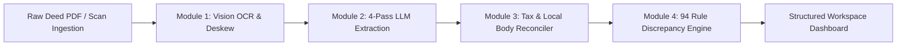

# DelhiTSR
Title Intelligence Engine (Delhi NCT & Haryana [BETA])

<p>
  <a href="https://www.python.org/"></a>
  <a href="https://flask.palletsprojects.org/"></a>
  <a href="https://opencv.org/"></a>
  <a href="https://deepmind.google/"></a>
  <a href="#complete-specification-of-all-94-discrepancy--validation-rules"></a>
  <a href="#"></a>
  <a href="#"></a>
</p>

DelhiTSR is a specialized title intelligence engine for property legal due diligence across the National Capital Territory (NCT) of Delhi and Haryana *(Haryana support operates in BETA)*. Designed for institutional mortgage underwriting, title search reporting (TSR), and legal property verification, it ingests multi-deed ownership chains, executes computer vision page deskewing and dual-engine OCR, extracts 80 structured document parameters through a 4-pass LLM pipeline, and evaluates title history against 94 deterministic rules covering statutory stamp duty tariffs, municipal transfer taxes, boundary continuity, and local Sub-Registrar Office (SRO) regulations.

> **Note**: DelhiTSR is under active development. While the engine currently parses documents, reconciles taxes, and audits 94 legal rules, compiled Title Search Report (TSR) generation will be added in future releases.

---

## Table of Contents

- [System Architecture \& Pipeline Workflow](#system-architecture--pipeline-workflow)
- [Module 1: Document Pre-processing \& Dual-Engine OCR](#module-1-document-pre-processing--dual-engine-ocr)
- [Module 2: 4-Pass 80-Parameter Extraction Pipeline](#module-2-4-pass-80-parameter-extraction-pipeline)
- [Module 3: Universal Tax \& Local Authority Reconciliation Engine](#module-3-universal-tax--local-authority-reconciliation-engine)
  - [Delhi Statutory Duty \& MCD Tax Matrix](#delhi-statutory-duty--mcd-tax-matrix)
  - [Haryana Urban vs. Rural Jurisdiction Engine [BETA]](#haryana-urban-vs-rural-jurisdiction-engine-beta)
  - [Constituent Tax Aggregation Algorithm](#constituent-tax-aggregation-algorithm)
- [Recognized Financial Institutions \& Mortgage Lenders](#recognized-financial-institutions--mortgage-lenders)
- [5-Tier Legal Severity Classification Framework](#5-tier-legal-severity-classification-framework)
- [Complete Specification of All 94 Discrepancy \& Validation Rules](#complete-specification-of-all-94-discrepancy--validation-rules)
  - [1. Legal \& Statutory Compliance Audits](#1-legal--statutory-compliance-audits)
  - [2. Consideration \& Financial Valuation Audits](#2-consideration--financial-valuation-audits)
  - [3. Title Chain \& Ownership Integrity Audits](#3-title-chain--ownership-integrity-audits)
  - [4. Party Identity, PAN \& KYC Audits](#4-party-identity-pan--kyc-audits)
  - [5. Party Name Spelling Deviation Audits](#5-party-name-spelling-deviation-audits)
  - [6. Mortgage, Encumbrance \& Charge Release Audits](#6-mortgage-encumbrance--charge-release-audits)
  - [7. Lender Bank Match \& Merger Transition Audits](#7-lender-bank-match--merger-transition-audits)
  - [8. Project Metadata Reconciliation Audits](#8-project-metadata-reconciliation-audits)
  - [9. Statutory Stamp Duty \& Municipal Tax Audit Matrix](#9-statutory-stamp-duty--municipal-tax-audit-matrix)
  - [10. Haryana Jurisdiction \& Revenue Estate Audits [BETA]](#10-haryana-jurisdiction--revenue-estate-audits-beta)
  - [11. Pre-Processing \& Computer Vision Rules](#11-pre-processing--computer-vision-rules)
  - [12. Meta-Rules \& Legal Privilege Enforcement](#12-meta-rules--legal-privilege-enforcement)
- [No-Verdict Policy \& Legal Privilege Protection](#no-verdict-policy--legal-privilege-protection)
- [Setup \& Local Development Installation](#setup--local-development-installation)
- [Repository File Blueprint](#repository-file-blueprint)

---

## System Architecture & Pipeline Workflow

Property title chains in India consist of heterogeneous, multi-page scanned documents spanning 30+ years of ownership history. Standard document parsing engines fail on these inputs due to split tax receipts (e.g., separate stamp duty and local authority tax payments), missing localized statutory context (e.g., pre-2003 DDA conveyance stamp exemptions), and LLM context drift on long files.

DelhiTSR decouples image pre-processing, schema extraction, tax reconciliation, and rule evaluation into isolated processing stages:



---

## Module 1: Document Pre-processing & Dual-Engine OCR

Before document text is parsed, pages undergo automated computer vision processing:

1. **Orientation Angle Detection**: `pypdfium2` renders PDF pages to numpy arrays. OpenCV detects baseline text orientation using minimum area bounding rectangles (`cv2.minAreaRect`).
2. **Affine Rotation**: Rotates pages back to 0° alignment for detected skew angles between 0.5° and 45.0°.
3. **Otsu Binarization**: Cleans background yellowing, shadow artifacts, and faint watermarks using Otsu thresholding (`cv2.THRESH_OTSU`).
4. **Adaptive Text Extraction Pipeline**:
   * **Direct Vector Stream**: Embedded digital fonts are extracted directly via `pdfplumber`.
   * **RapidOCR Fallback**: If page text density is below 40 characters per page (indicating scanned images), pages automatically route to `rapidocr-onnxruntime` with OpenCV contrast enhancement.
   * **Multimodal Vision Fallback**: Handwritten recitals, faint endorsement stamps, or damaged paper marginalia route to Gemini 2.5 Vision.

---

## Module 2: 4-Pass 80-Parameter Extraction Pipeline

To prevent context drift and attention splitting across 50+ page legal deeds, extraction is partitioned into 4 specialized schema passes, extracting 80 target parameters per document:

* **Pass 1: Document Identity & Stamp Paper Ledger**
  * Registration number, volume/page numbers, SRO office, e-stamp certificate number, issue date, article number, execution date, registration date.
* **Pass 2: Party Identity, Gender & KYC Ledger**
  * Transferor and transferee names, PAN identifiers, masked Aadhaar numbers, gender classification (sole female, joint, male), PIN codes, party residential addresses.
* **Pass 3: Financial Consideration & Payment Instrument Ledger**
  * Stated consideration, rental fee/premium, secured loan principal, e-stamp value, MCD tax amount, local authority tax, cheque/DD/RTGS numbers, TDS Form 26QB verification.
* **Pass 4: Property Schedule & Boundary Chain**
  * Property address, plot/flat number, survey/khasra/hadbast number, floor level, share percentage, area measurement and units (Sq. Yards, Bigha, Biswas, Sq. Meters), north/south/east/west boundaries.

---

## Module 3: Universal Tax & Local Authority Reconciliation Engine

### Delhi Statutory Duty & MCD Tax Matrix

Evaluates compliance under the Indian Stamp Act, 1899 (Schedule I-A Delhi Amendment) and Section 147 of the Delhi Municipal Corporation Act, 1957:

| Period / Document Category | Sole Female Purchaser | Joint (Female + Male) | Male Purchaser | Statutory Reference |
| :--- | :--- | :--- | :--- | :--- |
| **Pre-2003 Resale Conveyances** | 8.00% | 8.00% | 8.00% | Article 23 (5% SD + 3% MCD Tax) |
| **Pre-2003 DDA / Government Conveyances** | **6.00%** | **6.00%** | **6.00%** | Pre-2003 DDA Statutory Rule |
| **2003 – 2007 Conveyance Deeds** | 5.00% | 7.00% | 8.00% | Delhi Notification 2003 Tariff |
| **2008 – Present Conveyance Deeds** | **4.00%** *(3% SD + 1% MCD)* | **5.00%** *(3.5% SD + 1.5% MCD)* | **6.00%** *(3% SD + 3% MCD)* | Current NCT Delhi Duty Schedule |
| **Blood Relative Gift Deed** | 3.00% | 3.00% | 3.00% | Family Concession Schedule (+ 1% Reg Fee) |
| **Simple Mortgage without Possession** | 2.00% | 2.00% | 2.00% | Article 40 (2% on Principal Amount) |
| **Equitable Mortgage (Title Deposit)** | 0.50% | 0.50% | 0.50% | Article 40(b) Capped Schedule |

### Haryana Urban vs. Rural Jurisdiction Engine [BETA]

> **[BETA STAGE MODULE]**: *All Haryana statutory stamp duty, registration fee slab, and urban vs. rural Gram Panchayat jurisdiction rules operate under BETA status.*

Evaluates compliance under the Haryana Stamp Act and Haryana Municipal Corporation Act:

| Transferee Composition | Urban Municipal Area *(MCG / MCF / Sector / HUDA)* | Rural Gram Panchayat Area *(Hadbast / Revenue Estate)* |
| :--- | :--- | :--- |
| **Sole Female Purchaser(s)** | **5.00%** *(3% Stamp Duty + 2% Municipal Duty)* | **3.00%** *(3% Stamp Duty + 0% Municipal Duty)* |
| **Joint Purchasers (Male + Female)** | **6.00%** *(4% Stamp Duty + 2% Municipal Duty)* | **4.00%** *(4% Stamp Duty + 0% Municipal Duty)* |
| **Male Purchaser(s)** | **7.00%** *(5% Stamp Duty + 2% Municipal Duty)* | **5.00%** *(5% Stamp Duty + 0% Municipal Duty)* |

* **Haryana Registration Fee Slabs [BETA]**: Haryana applies a slab-based registration fee structure capped at ₹50,000 for considerations over ₹1 Crore.

### Constituent Tax Aggregation Algorithm

To prevent false deficit findings when stamp duty and local body transfer taxes are paid on separate receipts, `_compute_total_stamp_duty_paid` executes dynamic aggregation:

`Total Duty Paid = Max(E-Stamp Certificate Amount, Total Non-Judicial Stamp Paper, Sum of Constituent Line Items)`

Where `Sum of Constituent Line Items = State Stamp Duty (Article 23) + MCD Transfer Tax (Sec 147) + Local Body Tax`.

---

## Recognized Financial Institutions & Mortgage Lenders

The engine incorporates a normalized lender entity ledger that resolves spelling variations, branch suffixes, and historical bank mergers when auditing mortgage charges and release deeds:

| Institution Category | Recognized Entities & Banking Institutions |
| :--- | :--- |
| **Public Sector Banks** | State Bank of India (SBI), Punjab National Bank (PNB), Bank of Baroda (BOB), Union Bank of India, Canara Bank, Indian Bank, Bank of India (BOI), Central Bank of India, Indian Overseas Bank, UCO Bank, Punjab & Sind Bank. |
| **Private Sector Banks** | HDFC Bank, ICICI Bank, Axis Bank, Kotak Mahindra Bank, IndusInd Bank, YES Bank, IDBI Bank, Federal Bank, Jammu & Kashmir Bank, RBL Bank. |
| **Housing Finance Companies (HFCs) & NBFCs** | LIC Housing Finance Ltd (LICHFL), PNB Housing Finance, Tata Capital Housing Finance, Bajaj Housing Finance, Aditya Birla Housing Finance, Indiabulls Housing Finance, Home First Finance Company, Aavas Financiers, DMI Housing Finance. |
| **Historical Merger Transitions** | • *Corporation Bank / Andhra Bank* $\rightarrow$ **Union Bank of India**<br>• *Syndicate Bank* $\rightarrow$ **Canara Bank**<br>• *Allahabad Bank* $\rightarrow$ **Indian Bank**<br>• *Oriental Bank of Commerce / United Bank of India* $\rightarrow$ **Punjab National Bank**<br>• *Vijaya Bank / Dena Bank* $\rightarrow$ **Bank of Baroda** |

---

## 5-Tier Legal Severity Classification Framework

- **Material Defect**
- **Substantive Defect**
- **Statutory Requisition**
- **Procedural Anomaly**
- **Record Notation**

---

## Complete Specification of All 94 Discrepancy & Validation Rules

The engine executes 94 deterministic audit routines across 12 specialized functional modules. Each rule evaluates specific document inputs, statutory provisions, and title parameters, assigning one of the 5 platform legal severity tiers:

### 1. Legal & Statutory Compliance Audits

Audits compliance against statutory registration laws, SRO territorial jurisdiction, and power of attorney execution mandates:

| Code | Severity | Finding Name | Verification Function & Legal Scope |
| :--- | :--- | :--- | :--- |
| `VOID_DEED_WRONG_SRO` | **Material Defect** | SRO Jurisdiction Mismatch | Checks if the document was registered at the correct Sub-Registrar Office (SRO) for the property's location (Sec 28, Registration Act 1908). |
| `GPA_POST_2011_INVALID` | **Material Defect** | Post-2011 GPA Title Transfer | Flags property transfers done via Power of Attorney (GPA) after October 11, 2011 without a registered Sale Deed (*Suraj Lamp* Supreme Court ruling). |
| `MISSING_GPA_AUTHORIZATION` | **Material Defect** | Missing Attorney Authorization | Checks if a deed signed by an attorney includes a registered Power of Attorney (GPA/SPA) in the document chain. |
| `UNREGULARIZED_GPA_CHAIN` | **Substantive Defect** | Unregularized GPA Chain | Flags title histories that end with a Power of Attorney instead of a registered Sale Deed. |
| `PROPERTY_NOT_IN_DELHI` | **Procedural Anomaly** | Out-of-Jurisdiction Location | Flags properties located outside NCT Delhi revenue districts or Haryana (BETA) boundaries. |
| `SEC28_REG_ACT_AUDIT` | **Record Notation** | Mandatory SRO Validation | Audits official registry stamps against local SRO territorial boundaries (Sec 28, Registration Act 1908). |
| `SRO_TERRITORY_MATRIX` | **Record Notation** | SRO Territory Ledger Mapping | Verifies SRO office assignments against Delhi's 350+ official locality map. |
| `SRO_CODE_NORMALIZER` | **Record Notation** | SRO Code Canonicalization | Standardizes SRO name variations (e.g., 'SRO V-A Hauz Khas' to `5a`) for system processing. |
| `SRO_LOCALITY_TOKEN_MATCH` | **Record Notation** | Locality Boundary Token Check | Matches the property address against official SRO locality listings. |
| `EXPLICIT_SRO_RECITAL` | **Record Notation** | Explicit Header SRO Recital | Checks that SRO mentions in the text match official registration stamps on the deed. |

### 2. Consideration & Financial Valuation Audits

Audits monetary consideration declarations, lease rentals, mortgage principal amounts, and gift deed validity:

| Code | Severity | Finding Name | Verification Function & Legal Scope |
| :--- | :--- | :--- | :--- |
| `MISSING_SALE_CONSIDERATION` | **Material Defect** | Missing Sale Price | Ensures a valid sale price is stated in the sale deed (Sec 54, Transfer of Property Act 1882). |
| `MISSING_RENTAL_CONSIDERATION` | **Material Defect** | Missing Lease License Fee | Checks that rent or monthly license fees are stated in lease and license agreements (Sec 105, Transfer of Property Act 1882). |
| `MISSING_MORTGAGE_VALUE` | **Material Defect** | Missing Secured Loan Principal | Ensures mortgage deeds clearly state the loan principal amount (Sec 58, Transfer of Property Act 1882). |
| `GIFT_DEED_WITH_CONSIDERATION` | **Material Defect** | Gift with Consideration | Flags gift deeds that mention money changing hands, as gifts must be voluntary without payment (Sec 122, Transfer of Property Act 1882). |
| `CONSIDERATION_ZERO_OR_NEGATIVE` | **Material Defect** | Invalid Consideration Value | Flags deeds with zero, negative, or invalid transaction values. |
| `CONSIDERATION_FORMAT_AUDIT` | **Record Notation** | Consideration Parsing Validation | Checks for typos between numbers and written word amounts (e.g., ₹5,00,000 vs. 'Fifty Thousand'). |
| `CONSIDERATION_CURRENCY_CHECK` | **Record Notation** | Currency Unit Standardization | Verifies that payment amounts are correctly recorded in Indian Rupees (INR / ₹). |

### 3. Title Chain & Ownership Integrity Audits

Audits 30-year ownership continuity, link deed sequencing, execution dates, and revenue mutation records:

| Code | Severity | Finding Name | Verification Function & Legal Scope |
| :--- | :--- | :--- | :--- |
| `CHAIN_BREAK_TRANSFEROR_MISMATCH` | **Material Defect** | Ownership Chain Break | Checks that the seller in each deed matches the buyer from the previous deed to ensure an unbroken ownership chain. |
| `CHRONOLOGICAL_DATE_ANOMALY` | **Material Defect** | Reverse Date Sequencing | Flags documents where a newer deed is dated earlier than the previous owner's purchase deed. |
| `FUTURE_REGISTRATION_DATE` | **Material Defect** | Future Registration Stamp | Flags registration dates listed in the future relative to the document date. |
| `MUTATION_RECORD_MISSING` | **Substantive Defect** | Missing Revenue Mutation Record | Flags property transfers that lack government revenue mutation records (Khasra/Khatauni or MCD tax mutation). |
| `MULTIPLE_ACTIVE_OWNERS` | **Substantive Defect** | Ambiguous Undivided Ownership | Detects conflicting ownership claims where multiple parties claim 100% ownership of the same property. |
| `DEED_EXECUTION_DATE_MISSING` | **Procedural Anomaly** | Missing Execution Date | Checks for missing signing dates on deeds. |
| `DEED_REGISTRATION_DATE_MISSING` | **Procedural Anomaly** | Missing SRO Registration Date | Flags deeds missing official Sub-Registrar endorsement dates. |
| `TITLE_CHAIN_SPAN_AUDIT` | **Record Notation** | Title History Duration Check | Calculates total years of ownership history and flags chains under the standard 30-year requirement. |
| `PARTIAL_SHARE_TRANSFER_CHECK` | **Record Notation** | Undivided Share Audit | Tracks what percentage of property share is transferred in each document. |
| `DOCUMENT_SEQUENCE_NORMALIZER` | **Record Notation** | Chronological Ledger Order | Sorts uploaded documents in chronological order by registration date. |

### 4. Party Identity, PAN & KYC Audits

Audits party identities, Income Tax PAN compliance, corporate CIN numbers, and signatory capacity:

| Code | Severity | Finding Name | Verification Function & Legal Scope |
| :--- | :--- | :--- | :--- |
| `MISSING_TRANSFEROR_NAME` | **Material Defect** | Missing Seller Identity | Checks for missing seller names in documents. |
| `MISSING_TRANSFEREE_NAME` | **Material Defect** | Missing Buyer Identity | Checks for missing buyer names in documents. |
| `INVALID_PAN_FORMAT` | **Substantive Defect** | Structural PAN Defect | Verifies that Income Tax PAN numbers match the official 10-character format (`ABCDE1234F`). |
| `MISSING_PARTY_PAN` | **Statutory Requisition** | Missing Income Tax PAN | Flags high-value transactions missing PAN numbers or Form 60/61 declarations (Sec 139A, Income Tax Act 1961). |
| `CORPORATE_CIN_CHECK` | **Procedural Anomaly** | Corporate Identity Audit | Verifies Corporate Identification Numbers (CIN/LLPIN) when companies buy or sell property. |
| `PARTY_ADDRESS_MISSING` | **Procedural Anomaly** | Missing Party Address | Flags documents missing formal buyer or seller addresses. |
| `REPRESENTATIVE_CAPACITY_CHECK` | **Record Notation** | Execution Authority Audit | Checks board resolutions or authorizations when signatories act on behalf of companies or trusts. |

### 5. Party Name Spelling Deviation Audits

Audits party name spelling variations across title chain documents, alias recitals, and honorifics:

| Code | Severity | Finding Name | Verification Function & Legal Scope |
| :--- | :--- | :--- | :--- |
| `NAME_SPELLING_CRITICAL_DEVIATION` | **Material Defect** | Major Name Mismatch | Flags major spelling differences in buyer or seller names between consecutive documents. |
| `NAME_SPELLING_MODERATE_DEVIATION` | **Substantive Defect** | Moderate Name Variation | Flags minor spelling variations (such as phonetic differences) across documents. |
| `ALIAS_NAME_RECITAL_CHECK` | **Statutory Requisition** | Alias / Also Known As Recital | Checks if name variations are explained by explicit alias recitals ('also known as') or official name change records. |
| `SALUTATION_NORMALIZER` | **Record Notation** | Name Honorific Normalization | Removes titles like Shri, Smt, Dr, or M/s before comparing names. |
| `SURNAME_INITIAL_EXPANSION` | **Record Notation** | Initial vs. Full Name Check | Matches abbreviated names against full names (e.g., 'R.K. Sharma' vs. 'Rajesh Kumar Sharma'). |
| `PARTY_ROLE_CANONICALIZER` | **Record Notation** | Party Role Normalization | Standardizes role terms like Vendor/Vendee or Lessor/Lessee into standard seller/buyer roles. |

### 6. Mortgage, Encumbrance & Charge Release Audits

Audits outstanding bank mortgages, reconveyance deeds, NOC certificates, court attachments, and lis pendens notices:

| Code | Severity | Finding Name | Verification Function & Legal Scope |
| :--- | :--- | :--- | :--- |
| `UNRELEASED_MORTGAGE_CHARGE` | **Material Defect** | Outstanding Bank Charge | Flags past bank mortgages that lack a registered Bank Release Deed or Reconveyance Deed. |
| `MISSING_RECONVEYANCE_DEED` | **Material Defect** | Missing Release Deed | Flags paid-off bank loans that lack a registered Release Deed on record. |
| `MORTGAGE_AMOUNT_EXCEEDED` | **Substantive Defect** | Charge Amount Discrepancy | Checks that bank release deed amounts match the original loan amount in the mortgage deed. |
| `NOC_BANK_RELEASE_MISSING` | **Substantive Defect** | Missing Bank No Objection Certificate | Flags transactions on mortgaged property conducted without a written No Objection Certificate (NOC) from the bank. |
| `ENCLOSED_DEPOSIT_TITLE_DEEDS` | **Statutory Requisition** | Equitable Mortgage Audit | Checks Memorandum of Deposit of Title Deeds (MODTD) registration under Sec 17 of the Registration Act 1908. |
| `MORTGAGE_DATE_PRIORITY` | **Substantive Defect** | Mortgage Priority Audit | Checks priority order when multiple mortgages exist on the same property (Sec 48, Transfer of Property Act 1882). |
| `RELEASE_DEED_PARTY_MISMATCH` | **Substantive Defect** | Mortgagee Identity Mismatch | Flags release deeds signed by an entity other than the original bank without proof of debt transfer. |
| `PARTIAL_RELEASE_CHARGE` | **Statutory Requisition** | Partial Reconveyance Audit | Identifies partial loan payoffs where a mortgage charge remains active on part of the property. |
| `LIS_PENDENS_CHARGE_CHECK` | **Material Defect** | Pending Court Litigation Charge | Flags ongoing court disputes or stay orders mentioned in property records (Sec 52, Transfer of Property Act 1882). |
| `ATTACHMENT_ORDER_CHECK` | **Material Defect** | Judicial / Revenue Attachment | Flags government tax liens or court orders attaching the property. |
| `LENDER_MERGER_TRANSITION` | **Record Notation** | Bank Merger Mapping | Maps historical bank mergers (e.g., Corporation Bank to Union Bank of India) when checking bank release deeds. |
| `MORTGAGE_PROPERTY_SCHEDULE_MATCH` | **Procedural Anomaly** | Mortgage Property Match | Verifies that property descriptions in mortgage deeds match the main title deed. |
| `RECHARGE_STAMP_DUTY_CHECK` | **Statutory Requisition** | Mortgage Stamp Duty Audit | Checks stamp duty paid on mortgage deeds (Article 40, Indian Stamp Act 1899). |
| `MODTD_REGISTRATION_CHECK` | **Statutory Requisition** | MODTD Registration Audit | Verifies compulsory registration of equitable mortgage deposit memorandums under state stamp laws. |
| `ENCUMBRANCE_FREE_DECLARATION` | **Record Notation** | Encumbrance Warranty Recital | Checks seller promises in the deed confirming the property is free of loans, liens, and court cases. |
| `CHARGE_REGISTER_CANONICALIZER` | **Record Notation** | Encumbrance Ledger Normalization | Combines all past and current bank charges into a single clear property status list. |

### 7. Lender Bank Match & Merger Audits

Audits recognized lending institutions, historical bank mergers, and SARFAESI enforcement charges:

| Code | Severity | Finding Name | Verification Function & Legal Scope |
| :--- | :--- | :--- | :--- |
| `UNRECOGNIZED_LENDING_INSTITUTION` | **Procedural Anomaly** | Unknown Lender Entity | Flags mortgage deeds involving unrecognized lenders outside official Public/Private banks, HFCs, and NBFCs. |
| `HISTORICAL_BANK_MERGER_MAP` | **Record Notation** | Merger Succession Mapping | Automatically handles bank mergers (e.g., Syndicate Bank to Canara Bank, e-Vijaya Bank to Bank of Baroda). |
| `NBFC_HFC_REGISTRATION_CHECK` | **Statutory Requisition** | RBI / NHB License Audit | Checks regulatory license status for housing finance companies and NBFC lenders under RBI/NHB rules. |
| `MORTGAGEE_NAME_STANDARDIZATION` | **Record Notation** | Lender Name Normalization | Standardizes bank name variations (e.g., 'State Bank of India', 'SBI', 'S.B.I.') into a single clean format. |
| `ASSIGNMENT_OF_DEBT_CHECK` | **Substantive Defect** | Debt Assignment Verification | Verifies debt assignment deeds when loan portfolios are transferred between banks. |
| `SARFAESI_NOTICE_CHECK` | **Material Defect** | SARFAESI Enforcement Charge | Flags bank loan default notices or auction proceedings under the SARFAESI Act 2002. |

### 8. Project Metadata Reconciliation Audits

Audits plot/unit numbers, square footage area calculations, four-sided boundaries, and locality names:

| Code | Severity | Finding Name | Verification Function & Legal Scope |
| :--- | :--- | :--- | :--- |
| `PLOT_NUMBER_MISMATCH` | **Material Defect** | Plot Identifier Mismatch | Checks that plot and flat numbers stay consistent across all documents in the ownership history. |
| `PROPERTY_AREA_DISCREPANCY` | **Substantive Defect** | Area Calculation Deviation | Flags discrepancies in property area (sq. ft. or sq. yards) between original and newer deeds. |
| `BOUNDARY_NORTH_MISMATCH` | **Procedural Anomaly** | North Boundary Mismatch | Cross-checks North boundary descriptions across consecutive deeds. |
| `BOUNDARY_SOUTH_MISMATCH` | **Procedural Anomaly** | South Boundary Mismatch | Cross-checks South boundary descriptions across consecutive deeds. |
| `BOUNDARY_EAST_MISMATCH` | **Procedural Anomaly** | East Boundary Mismatch | Cross-checks East boundary descriptions across consecutive deeds. |
| `BOUNDARY_WEST_MISMATCH` | **Procedural Anomaly** | West Boundary Mismatch | Cross-checks West boundary descriptions across consecutive deeds. |
| `COLONY_NAME_NORMALIZER` | **Record Notation** | Locality Name Normalization | Standardizes colony names (e.g., 'Hauz Khas Enclave' vs. 'Hauz Khas') against official locality listings. |
| `UNIT_MEASUREMENT_CONVERSION` | **Record Notation** | Area Unit Standardization | Converts different measurement units (sq. yards, sq. meters, bigha, biswa) into square feet. |
| `PROPERTY_TYPE_CANONICALIZER` | **Record Notation** | Property Classification | Classifies property usage (Residential, Commercial, Industrial, Agricultural) based on deed text. |
| `ADDRESS_LINE_RECONCILIATION` | **Record Notation** | Full Address Parsing | Reconciles full property addresses against municipal and postal records. |

### 9. Statutory Stamp Duty & Municipal Tax Audit Matrix

Audits statutory stamp duty compliance, MCD transfer taxes, gender concessions, e-stamp validation, and minimum circle rates:

| Code | Severity | Finding Name | Verification Function & Legal Scope |
| :--- | :--- | :--- | :--- |
| `STAMP_DUTY_DEFICIT_MALE` | **Statutory Requisition** | Male Stamp Duty Deficit | Checks if male buyers paid the required stamp duty rate (6% total in Delhi: 4% stamp duty + 2% MCD tax). |
| `STAMP_DUTY_DEFICIT_FEMALE` | **Statutory Requisition** | Female Stamp Duty Deficit | Checks if female buyers received the statutory concession rate (4% total in Delhi: 3% stamp duty + 1% MCD tax). |
| `STAMP_DUTY_DEFICIT_JOINT` | **Statutory Requisition** | Joint Stamp Duty Deficit | Checks if joint (male + female) buyers paid the joint rate (5% total in Delhi). |
| `MCD_TRANSFER_TAX_DEFICIT` | **Statutory Requisition** | MCD Transfer Tax Deficit | Checks municipal transfer tax payment under Sec 147 of the Delhi Municipal Corporation Act 1957. |
| `PRE_2003_CONVEYANCE_TAX_CHECK` | **Record Notation** | Pre-2003 Flat Rate Duty Check | Evaluates stamp duty compliance for older conveyances registered before 2003 under flat 8% rules. |
| `DDA_CONVEYANCE_EXEMPTION` | **Record Notation** | DDA Statutory Concession | Applies statutory stamp duty rules for original DDA or Government allotment conveyances before 2003 (6% rate). |
| `E_STAMP_CERTIFICATE_VERIFY` | **Record Notation** | E-Stamp Authentication | Verifies e-stamp certificate numbers, dates, and amounts against official registry records. |
| `STAMP_PAPER_DATE_PRECEDENCE` | **Procedural Anomaly** | Stamp Paper Date Precedence | Checks that stamp paper was purchased on or before the deed signing date (Sec 29, Indian Stamp Act 1899). |
| `CIRCLE_RATE_EVALUATION` | **Statutory Requisition** | Minimum Circle Rate Audit | Calculates minimum legal property valuation based on Delhi Category A-H circle rates and flags undervaluation. |
| `UNDERVALUATION_PENALTY_CHECK` | **Statutory Requisition** | Undervaluation Requisition | Flags stamp duty shortfalls subject to impounding and penalty under Sec 47A of the Indian Stamp Act 1899. |
| `AGGREGATE_DUTY_COMPUTATION` | **Record Notation** | Multi-Receipt Duty Aggregation | Combines payments across multiple e-stamp receipts, state stamp duty, and municipal transfer tax. |
| `ARTICLE_23_CONVEYANCE_DUTY` | **Record Notation** | Article 23 Conveyance Tariff | Checks conveyance stamp duty rates under Article 23 of the Indian Stamp Act 1899. |
| `ARTICLE_55_RELEASE_DUTY` | **Record Notation** | Article 55 Release Tariff | Checks stamp duty paid on Release or Relinquishment Deeds (Article 55, Indian Stamp Act 1899). |
| `ARTICLE_33_GIFT_DUTY` | **Record Notation** | Article 33 Gift Tariff | Checks stamp duty paid on Gift Deeds (Article 33, Indian Stamp Act 1899). |
| `ARTICLE_48_GPA_DUTY` | **Record Notation** | Article 48 Power of Attorney Tariff | Checks stamp duty paid on Power of Attorney documents (Article 48, Indian Stamp Act 1899). |
| `ARTICLE_35_LEASE_DUTY` | **Record Notation** | Article 35 Lease Tariff | Checks stamp duty paid on Lease Agreements based on lease length and annual rent (Article 35). |
| `ARTICLE_40_MORTGAGE_DUTY` | **Record Notation** | Article 40 Mortgage Tariff | Checks stamp duty paid on Mortgage Deeds (Article 40, Indian Stamp Act 1899). |
| `FEMALE_CONCESSION_ELIGIBILITY` | **Record Notation** | Female Rate Concession Audit | Verifies buyer details to ensure female stamp duty discount eligibility. |
| `STAMP_REFUND_CLAIM_CHECK` | **Record Notation** | Unused Stamp Paper Audit | Checks unused or cancelled stamp papers submitted for refund within the 6-month limit (Sec 49). |
| `IMPOUNDING_RISK_ASSESSMENT` | **Substantive Defect** | Deed Impounding Risk | Flags understamped deeds at risk of being impounded by the Collector of Stamps (Sec 33, Indian Stamp Act). |
| `REGISTRATION_FEE_CHECK` | **Statutory Requisition** | Statutory Registration Fee Audit | Checks 1% statutory registration fees paid at the SRO office. |
| `PAST_STAMP_LAW_AMENDMENT_MAP` | **Record Notation** | Historical Stamp Rate Ledger | Applies past Delhi stamp duty rate changes (1995, 2003, 2008, 2012) based on deed dates. |
| `TAX_EXEMPTION_RECITAL_VERIFY` | **Record Notation** | Statutory Exemption Recital | Verifies statutory tax exemption claims (such as government grants) against official notifications. |

### 10. Haryana Jurisdiction & Revenue Estate Audits [BETA]

> **Note**: *All Haryana rules and jurisdiction audit routines operate in BETA.*

Audits Haryana Municipal Corporation (MCG/MCF) vs. rural Gram Panchayat duty rates, Hadbast numbers, and Khasra parcels:

| Code | Severity | Finding Name | Verification Function & Legal Scope |
| :--- | :--- | :--- | :--- |
| `HARYANA_URBAN_RURAL_CLASSIFIER` | **Record Notation** | Municipal vs Gram Panchayat Classifier | Classifies Haryana properties as Urban Municipal Corporation (MCG/MCF) vs. Rural Gram Panchayat areas. |
| `HARYANA_FEMALE_CONCESSION_CHECK` | **Statutory Requisition** | Haryana Female Concession Audit | Checks Haryana stamp duty rates (5% Urban / 3% Rural for females vs. 7% Urban / 5% Rural for males). |
| `HADBAST_NUMBER_AUDIT` | **Substantive Defect** | Hadbast / Khasra Verification | Cross-checks Hadbast (Revenue Estate) and Khasra parcel numbers against Haryana Land Records. |
| `HARYANA_GRAM_PANCHAYAT_DUTY` | **Statutory Requisition** | 2% Gram Panchayat Duty Audit | Checks the 2% local body transfer tax in rural Haryana Gram Panchayat areas. |

### 11. Pre-Processing & Computer Vision Rules

Audits document page orientation, affine deskewing, binarization quality, and dual-engine OCR routing:

| Code | Severity | Finding Name | Verification Function & Legal Scope |
| :--- | :--- | :--- | :--- |
| `PAGE_SKEW_ANGLE_DETECT` | **Record Notation** | Deskew Angle Detection | Detects page tilt angle (-45° to +45°) using OpenCV bounding box analysis (`cv2.minAreaRect`). |
| `AFFINE_ROTATION_DESKEW` | **Record Notation** | Computer Vision Page Deskew | Straightens tilted document page scans before text extraction. |
| `OTSU_BINARIZATION_CLEAN` | **Record Notation** | Artifact & Shadow Removal | Cleans background yellowing, stamp bleed, and shadows using adaptive Otsu thresholding (`cv2.THRESH_OTSU`). |
| `DUAL_ENGINE_OCR_ROUTER` | **Record Notation** | Digital Vector vs. OCR Routing | Routes pages to digital font extraction (`pdfplumber`) or vision OCR based on text quality. |
| `WATERMARK_SHADOW_SUPPRESSION` | **Record Notation** | Watermark Noise Filter | Filters out background watermarks and registry stamps that obscure deed text. |
| `RESOLUTION_DPI_NORMALIZER` | **Record Notation** | Image Resolution Normalization | Rescales low-resolution document scans to 300 DPI baseline for accurate text reading. |
| `MULTI_PAGE_SEQUENCE_CHECK` | **Record Notation** | Page Sequence Continuity | Detects missing or out-of-order pages in uploaded PDF packages. |
| `ENDORSEMENT_STAMP_CROP` | **Record Notation** | SRO Endorsement Bounding Box | Locates and crops official registration stamps on deed margins for targeted text extraction. |
| `IMAGE_BLUR_QUALITY_AUDIT` | **Record Notation** | Image Clarity Audit | Measures image sharpness to flag blurry or unreadable scans that need re-uploading. |

### 12. Meta-Rules & Legal Privilege Enforcement

Enforces no-verdict AI output boundaries, statutory privilege disclaimers, and PII confidentiality filters:

| Code | Severity | Finding Name | Verification Function & Legal Scope |
| :--- | :--- | :--- | :--- |
| `NO_VERDICT_PROSE_ENFORCER` | **Record Notation** | Legal Opinion Verdict Filter | Ensures output stays strictly neutral, filtering out definitive legal verdicts from AI text. |
| `PRIVILEGE_DISCLAIMER_ATTACH` | **Record Notation** | Legal Privilege Disclaimer | Attaches statutory disclaimers stating outputs are draft due diligence tools, not legal opinions. |
| `CONFIDENTIALITY_METADATA_GUARD` | **Record Notation** | Data Privacy & KYC Shield | Redacts personal identity details and private KYC data from system logs. |

---

## Legal Privilege Policy

1. **Factual Output Only**: The engine reports objective observations (such as stamp duty calculations, boundary discrepancies, or missing authorization documents). It does not declare titles void, defective, or invalid.
2. **Advocate Support**: Output is structured to support legal review while preserving advocate-client privilege.

---

## Setup & Local Development Installation

### Prerequisites

* Python 3.10+
* OpenCV & Poppler dependencies
* Tesseract OCR / ONNX Runtime (for RapidOCR)

### Step 1: Clone Repository & Create Virtual Environment

```bash
git clone https://github.com/your-org/tsr-engine.git
cd tsr-engine

# Create virtual environment
python -m venv venv

# Activate virtual environment
# Windows:
.\venv\Scripts\activate
# Linux/macOS:
source venv/bin/activate
```

### Step 2: Install Dependencies

```bash
pip install -r requirements.txt
```

### Step 3: Configure Environment Variables

Create a `.env` file in the root directory:

```env
FLASK_APP=app.py
FLASK_ENV=development
SECRET_KEY=your-secret-key-here
GEMINI_API_KEY=your-google-gemini-api-key
DATABASE_URL=sqlite:///instance/tsr_engine.db
```

### Step 4: Run Development Server

```bash
python app.py
```

---

## Repository File Blueprint

```
tsr-engine/
├── app.py                     # Flask application entrypoint & API routes
├── main.py                    # OpenCV deskewing, RapidOCR engine & 4-Pass LLM extraction
├── circle_rates.py            # Circle rates, stamp duty matrices & Haryana jurisdiction classifier
├── doris_scraper.py           # Delhi DORIS sub-registrar scraper session manager
├── deed_doc_scraper.py        # Sub-Registrar document indexing scraper
├── recital_verification.py    # Recital verification & boundary cross-matcher
├── stamp_verification.py      # E-Stamp certificate validation engine
├── static/                    # CSS, JavaScript UI components & assets
├── templates/
│   └── workspace.html         # Main dashboard & metric card views
├── instance/                  # SQLite database instance
├── uploads/                   # Temporary upload directory
└── requirements.txt           # Python dependencies manifest
```
